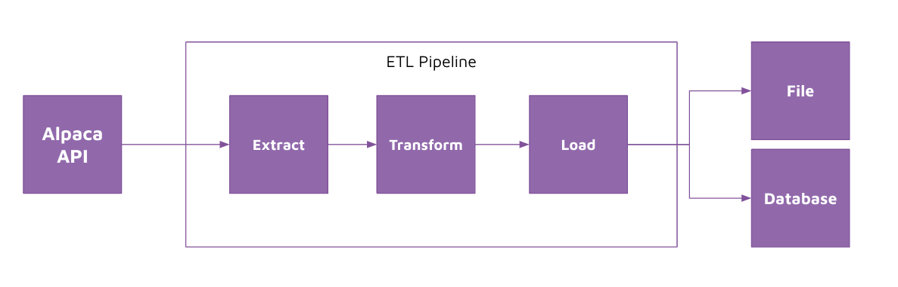

# Problem statement 

You are working for a financial institution. Your manager wants you to provide data consumers (data analysts and data scientists) with trades for a list of companies going all the way back to inception. Your manager wants you to provide the data in a form that is easily accessible by data consumers in the business. 

You remember hearing about ETL (Extract, Transform, Load) before and decided to use that approach for this project. 

