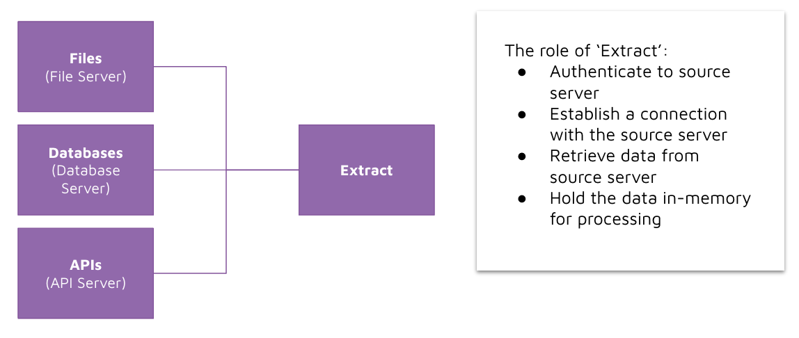

# Extract 

## Concept 

There are many types of possible data sources you might want to extract data from. Some examples include: 
- Files stored on a file server 
- Database tables stored on a database server 
- API endpoints hosted on an API server 

To extract data from those sources, we write code that handles: 
- Authentication to a source server 
- Establishing a connection to the source server 
- Retrieval of data from the source server 
- holding of the retrieved data in-memory or on disk for later processing (i.e. transform)

## How we will implement it 

We will use libraries in python that help us with extraction. These are: 
- `requests`: a library used for writing HTTP requests. This will help us with extracting data from APIs. 
- `pandas`: a library used for data manipulation. This will help us with extracting data from files. 

The demo we are going to see next involves writing code inside [Jupyter Notebook](https://jupyter.org/) which is an interactive way of running python, making it a lot easier to understand what is going on. 

Jupyter notebooks use the file extension `.ipynb`. 