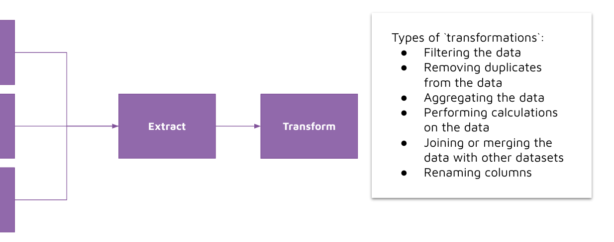

# Transforming data

## Concept 

After data has been extracted, and we are holding the data in-memory using a pandas dataframe, we can now perform transformation on the data. 

Transformation refers to steps taken to process or manipulate the data for our requirements or use-cases. Data transformations may include: 
- Filtering the data
- Removing duplicates from the data 
- Aggregating the data
- Performing calculations on the data 
- Joining or merging the data with other datasets 
- Renaming columns 

## How we will implement it 

We will use Pandas to perform data transformations. Notably, we will use the following functions for this demo: 
- [pd.merge()](https://pandas.pydata.org/docs/reference/api/pandas.DataFrame.merge.html)
- [df.rename()](https://pandas.pydata.org/docs/reference/api/pandas.DataFrame.rename.html)
- [df.mean()](https://pandas.pydata.org/docs/reference/api/pandas.DataFrame.mean.html)
- [df.sum()](https://pandas.pydata.org/docs/reference/api/pandas.DataFrame.sum.html)
- [pd.concat()](https://pandas.pydata.org/docs/reference/api/pandas.concat.html)
- [df.groupby()](https://pandas.pydata.org/docs/reference/api/pandas.DataFrame.groupby.html)
- [df.agg()](https://pandas.pydata.org/docs/reference/api/pandas.DataFrame.agg.html)

Review the docs for each function above. 