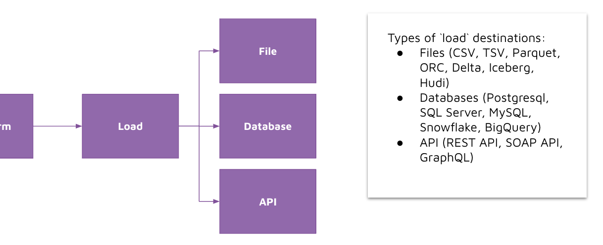

# Loading data 

## Concept 

After transforming the data and getting the data into it's final form, we are now ready to load the data into destinations that would support our end-users' needs and requirements. 

We have several destinations we can choose from with different types of usage patterns: 
- Files (CSV, TSV, Parquet, ORC, Delta, Iceberg, Hudi): particularly with parquet, orc, delta, iceberg, hudi - these tend to support very large volumes of data with cluster computing engines.  
- Databases (Postgresql, SQL Server, MySQL, Snowflake, BigQuery): data analysts and business intelligence analysts are most familiar with querying and pulling data from databases. 
- API (REST API, SOAP API, GraphQL): if the transformed data needs to be accessed by other web developers, then you may need to expose the data as an API. Although, the data engineer would often work with a web software developer in this situation. 

## How its implemented 

For this demo, we are loading our data to two destinations: 
- File (parquet)
    - parquet is a highly compressed file format, meaning that the file's size is only a fraction from it's original. 
    - parquet is a columnar file format rather than row-based, meaning that you can skip over the non-relevant data very quickly. As a result, aggregation queries are less time-consuming compared to row-oriented. 

- Database (postgres)
    - postgres is a free and open-source relational database. 
    - postgres can be easily hosted on all major cloud platforms (AWS, Azure, GCP). 

To load our data into the destinations, we will use: 
- Pandas: for saving the transformed dataset as a parquet file. 
- Pandas + SQLAlchemy: for saving the transformed dataset into a Postgres database table. SQLAlchemy is a library used for sending queries to a database, and has many built-in connectors to different database types e.g. MySQL, SQL Server, sqlite, etc. 

