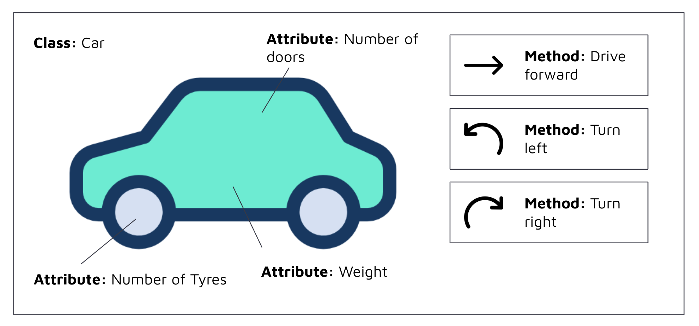

# Object oriented programming 

## Concept 

Now that we have learnt how to structure our code more neatly. We can take it a step further and apply object oriented programming to structure of code even better. 

Object oriented programming (OOP) chooses to see code as a representation of things. For example, we can create code that represents a Car which has attributes (e.g. car weight, length, number of doors) and actions, which are known as methods, that a car can perform (e.g. drive forwards, turn left, turn right). 



There a 4 key principles in object oriented programming: 

1. Encapsulation: all important information is contained inside an object. 
2. Abstraction: Objects hide all unnecessary implementation code and only exposes important functions. 
3. Inheritance: Classes can use code from other classes, thereby inheriting their properties. 
4. Polymorphism: the ability of a variable, function or object to take on multiple forms. For example, the Iterable class in Python can take on many forms such as List, which extends the functionality of Iterable. 

## Implementation 

We are going to implement OOP by creating the following structure for our code: 

```
src/                                            # the root folder where all our source code sits 
|__ set_python_path.sh                          # a shell helper function that sets our Python Path

|__ database/
    |__ __init__.py
    |__ postgres.py 
    |__ # other_database_connectors.py

|__ other_common_modules/* 

|__ project_name/                               # for example 'weather', which is what we'll be using 
    |__ __init__.py 
    |__ config.sh                               # for setting any environment variables (a.k.a. secret variables) 
    |__ data/*                                  # contains any data files used by the ETL that don't change very often 
    |__ etl/
        |__ __init__.py
        |__ extract.py
        |__ transform.py
        |__ load.py
    |__ pipeline/
        |__ __init__.py
        |__ pipeline.py
        |__ # any_other_pipelines.py

```

There is a lot to unpack above, we shall break it down here: 

- `src/`: is the root level folder for our code. Src is short for 'source', which is a naming convention used to represent the word 'code' or computer instructions. 
- `set_python_path.sh`: contains a simple shell command to set the `PYTHONPATH` variable to the `src/` folder. This ensures that Python can discover the following Python modules `database` and `weather`. 
- `__init__.py`: an empty file with the name `__init__.py` just tells Python to treat the folder as a Python module, thereby allowing us to import a folder as if it was a Python file or library. 
- `config.sh`: contains shell commands that help us set environment variables. Environemnt variables are used to set and retrieve secrets that we don't want to appear as plain text in our code. This will replace the `secrets_config.py` file that we have been using so far. 
    - We can set an environment variable by doing `export YOUR_VAR='your_secret'`. 
    - We can retrieve an environment variable on Python by doing: `os.environ.get("YOUR_VAR")`. 
- `database/`: contains Python code that establishes a connection to a database type. e.g. Postgres, MySQL, SQL Server, etc. 
- `project_name/`: replace `project_name` with your project name e.g. `weather`. The project will contain more folders to represent different sections of your project. 
- `etl/`: all ETL files will live here. We separate this from pipeline.
- `pipeline/`: all pipeline files will live here. Currently we only have 1 pipeline, but we may have multiple in the future. 

Within the python files, we shall create a `Class` that holds the `methods` (also known as functions) that go in it. 

```python
# EXAMPLE - extract.py

class Extract():

    @staticmethod
    def extract_city(
            api_key:str,
            city_name:str=None,
            temperature_units:str="metric"
        )->pd.DataFrame:
        """
        Extracting data from the weather API. 
        - api_key: api key 
        - city name: name of the city e.g. perth
        - temperature_units: choose one of "metric" or "imperial" or "standard"
        """
        params = {
            "q": city_name,
            "units": temperature_units,
            "appid": api_key
        }
        response = requests.get(f"http://api.openweathermap.org/data/2.5/weather", params=params)
        if response.status_code == 200: 
            weather_data = response.json()
        else: 
            raise Exception("Extracting weather api data failed. Please check if API limits have been reached.")
        df_weather_cities = pd.json_normalize(weather_data)
        return df_weather_cities
```


To run our code, we instead run the following shell commands in order: 

```
# 1. change directory to the src folder. 
cd your_path_to_src_folder/src

# 2. set the python path. You will only need to do this once. 
. ./set_python_path.sh

# 3. Set the environment variables. You will only need to do this once. 
. ./weather/config.sh 

# 4. Run your python pipeline 
python weather/pipeline/weather_pipeline.py

```
