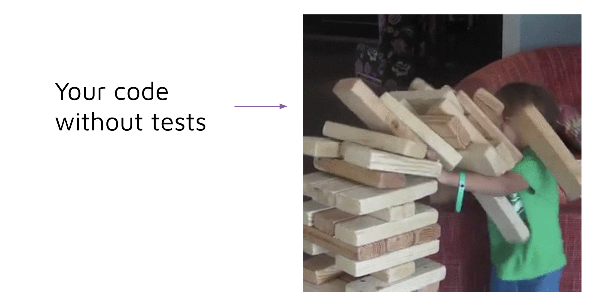
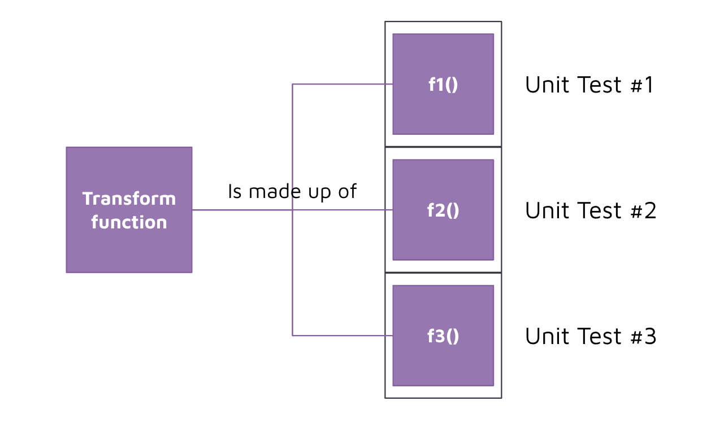

# Python Unit Tests

## Concept 

Now that we have written some powerful Python code, we want to make sure that our code performs as expected. Especially after we make changes to it, we want to make sure that we have not broken anything (this is also known as regression testing). 



To safeguard our code, we are going to write tests for our code. 

Tests can fall into different categories: 
- Unit test: testing the smallest testable parts of an application, called units.
- Integration test: testing different units or modules of an application as a combined entity.
- Data quality test: testing the data output of an application execution against normal data quality expectations. 
- Other types of tests e.g. smoke tests, functional tests, acceptance tests, performance tests. 

For our bootcamp, we will focus on (1) unit tests, (2) integration tests, (3) data quality tests. 

Unit tests can be broken down into 3 steps: 

1. Assemble: assembling the mock input and expected output data together. 
2. Act: passing our mock input data into the function and receiving actual output data. 
3. Assert: checking that our expected output data matches the actual output data returned from the function. 

## Implement 

To implement unit tests, we are going to use the [PyTest](https://docs.pytest.org/) library. 

It is very easy to create a new python test, we simply need to create a python file with `test_` prefixed or `_test` postfixed to the name of the file. 

Within the test file, we can write a function that asserts a condition, with `test_` prefixed or `_test` postfixed to the end of the function name. For example: 


```python
def inc(x):
    return x + 1

def test_answer():
    assert inc(3) == 5
```

To execute the file, we run: 

```
pytest
```

And we get the following output: 
```
=========================== test session starts ============================
platform linux -- Python 3.x.y, pytest-7.x.y, pluggy-1.x.y
rootdir: /home/sweet/project
collected 1 item

test_sample.py F                                                     [100%]

================================= FAILURES =================================
_______________________________ test_answer ________________________________

    def test_answer():
>       assert inc(3) == 5
E       assert 4 == 5
E        +  where 4 = inc(3)

test_sample.py:6: AssertionError
========================= short test summary info ==========================
FAILED test_sample.py::test_answer - assert 4 == 5
============================ 1 failed in 0.12s =============================
```

When we implement tests for our ETL pipeline, we look to apply these tests on the most granular functions before moving on to bigger functions. Some of these bigger functions will be tested with integration tests later. 

The code we are looking to test are typically steps within our transform function as it accepts an input dataframe and returns an output dataframe. 



We can pass in mock data to our transform function(s) and check if the output matches our expectation. 

To do so, we are going to use the following snippets of code. 


#### Assemble
```python
# assemble 
df_input = pd.DataFrame({
    "name": ["perth", "sydney"],
    "dt": [1657982968, 1657984968],
    "id": [1, 2],
    "main.temp": [27, 21]
})

df_input_population = pd.DataFrame({
    "city_name": ["perth", "sydney"],
    "population": [20000000, 60000000]
})

df_expected = df_expected = pd.DataFrame({
    "datetime": [1657982968, 1657984968],
    "id": [1, 2],
    "name": ["perth", "sydney"],
    "temperature": [27, 21],
    "population": [20000000, 60000000],
    "unique_id": ["16579829681", "16579849682"]
}).set_index("unique_id")
df_expected["datetime"] = pd.to_datetime(df_expected["datetime"], unit="s")
```

#### Act
```python
# act 
df_output = Transform.transform(df=df_input, df_population=df_input_population)
```

#### Assert
```python
# assert 
pd.testing.assert_frame_equal(left=df_output, right=df_expected,check_exact=True)
```