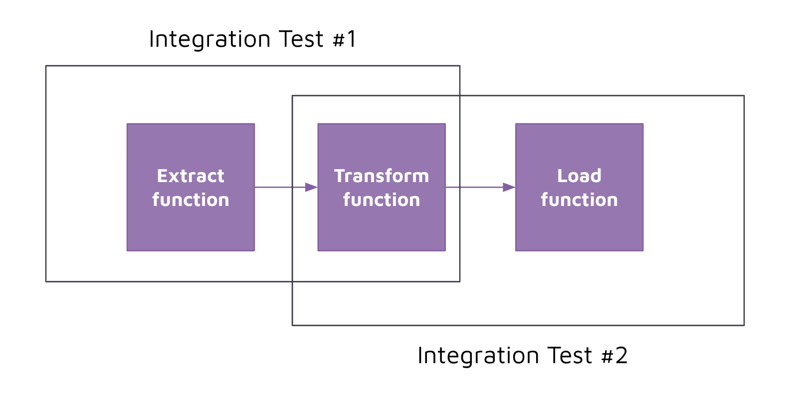

# Python Integration Tests 

## Concept 

Integration tests are similar to unit tests in the way they are constructed and executed. 

The difference is that unit tests look to test a specific unit of code, whereas the integration test looks to test several functions or modules at once. 

## Implementation 

For our ETL pipeline, we will write an integration test that tests the Extract and Transform logic. 

