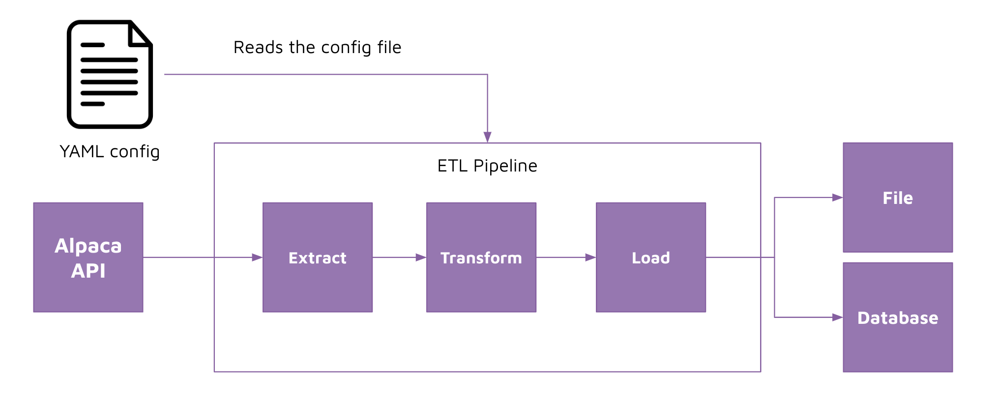

# Metadata config pipeline 

## Concept 

We want to be able to easily control our ETL configuration through external toggles rather than inside of our Python file. 

This makes it easy for other data engineers or even non-data engineers to change the settings of the ETL pipeline without having to fully understand what the code is doing. 



## Implementation 

We are going to store our ETL pipeline configuration in a [YAML](https://www.redhat.com/en/topics/automation/what-is-yaml) file. 

YAML stands for yet another markup language. It is a popular programming language because it is human-readable and easy to understand. 

The way YAML works is similar to JSON or Python Dictionaries and Lists. It uses key-value pairs to structure content and uses lists to hold multiple values. 

Here's an example: 

```
# filename: config.yaml

# key value pairs 
name: Martin D'vloper
job: Developer
skill: Elite
employed: True

# lists 
foods:
    - Apple
    - Orange
    - Strawberry
    - Mango

# nesting key value pairs and lists 
persons:
    - person: 
        name: Martin D'vloper
        job: Developer
    
    - person: 
        name: Bob D'engineer
        job: Data engineer
```

We can read YAML from Python and parse it as a dictionary using [PyYAML](https://pyyaml.org/wiki/PyYAMLDocumentation). 

```python
import yaml 

with open("config.yaml") as stream:
    config = yaml.safe_load(stream)

# use config like a dictionary/list 
print(config["persons"][0]["person"]["name"]) # will print Martin D'vloper
```

Let's implement this technique and store configurations for every user-defined parameter we pass in to our Extract, Transform and Load functions.
