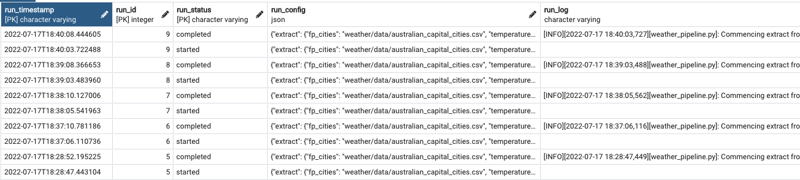

# Metadata logging 

## Concept 

When we leave execute our pipeline on a schedule, we would like to be able to monitor the performance of the ETL pipeline. 

To support that, we need to push (1) the logs from `logging()` and (2) the config file parameters at that point in time, into new logging table in postgresql. 

This will allow us to have the following table which will let us query the data and analyse errors as they come up. 

## Implementation 

First we will create a `MetadataLogging()` class in `utility/metadata_logging.py`. 

Creating an object of `MetadataLogging()` will establish a connection to the postgres database. The methods of the object consist of: 
- `create_target_table_if_not_exists()`: creates the target table where the logs will be written to 
- `get_latest_run_id()`: gets the latest run_id from the log table 
- `log()`: writes a log to the log table 

After creating the `MetadataLogging()` class and implementing its methods, we will use the class to write the logs to the database by using the following steps: 

1. Create a StringIO buffer by running `log_stream = StringIO()`. This is what we will use to buffer the logs to. 
2. Set up logging to push the logs into our `log_stream` buffer by configuring `logging.basicConfig(stream=log_stream)`. 
3. Create an object of the `MetadataLogging()` class e.g. `metadata_logger = MetadataLogging()` 
4. Get the target logging table name by using the `target_table_name` specified in YAML. 
5. Get the latest `run_id` from the logging table. A brand new table without any logs will just return `1` as the latest id. 
6. Obtain the `log_stream` values by running `log_stream.getvalue()`.  
7. Write the starting log by running `metadata_logger.log(run_status="started")`. 
8. Write the completion log by running `metadata_logger.log(run_status="completed")`. 
9. If there is an error, first catch the error by running `logger.exception(e)`, then write the error log by running `metadata_logger.log(run_status="error")`. 
10. Run the pipeline and check postgresql to see if the logs have been written. 
