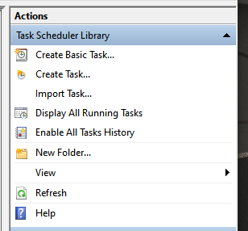
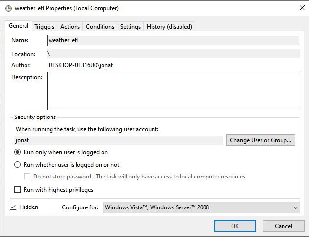
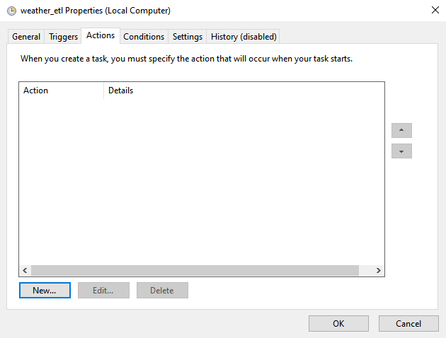
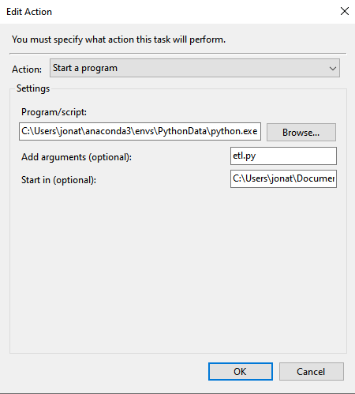
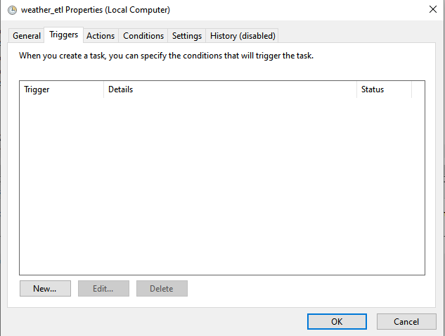
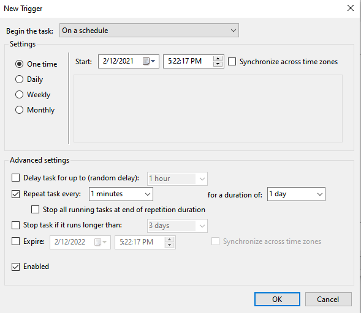

# Cron scheduling 

# Concept 

Now that we have successfully implemented our ETL pipeline and set it up properly for production, we need to schedule our ETL job. For that we are going to use Cron. Cron is a tool built in to unix systems that allows us to execute a task on schedule. On Windows, you can use Task Scheduler.

# Implement

## MacOS or Linux

### 1: Open crontab file 

In a new terminal, run the following commmand to open the crontab file using the nano editor:

```
env EDITOR=nano crontab -e
```

### 2: Update crontab file 

Once the crontab file is open, you can add a new cron job by adding a new line into the file:

```
* * * * * cd /Users/your_user/path_to_code/src && . ./set_python_path.sh && . ./your_project/config.sh && export PATH=~/opt/anaconda3/bin:$PATH && source activate your_conda_env && python your_project/pipeline/your_pipeline.py

# write the file using: CTRL + O
# close the file using: CTRL + X

```

Breaking it down: 
- `* * * * *`: refers to the cron frequency and tells cron to run every minute. See full guide [here](https://ole.michelsen.dk/blog/schedule-jobs-with-crontab-on-mac-osx/) on what each argument represents. 
- `/Users/your_user/path_to_code/src`: is the path to your project directory. Replace `your_user` with your user and `path_to_code` with your path to your code.  
- `&&`: is used to chain multiple commands together 
- `. ./set_python_path.sh`: sets the PYTHONPATH environment variable to your `src` folder 
- `export PATH=~/opt/anaconda3/bin:$PATH`: exports the path to your anaconda3 binary folder where the next step can find the `activate` program
- `source activate your_conda_env`: activates your conda environment. Replace `your_conda_env` with your conda environment name.  
- `python your_project/pipeline/your_pipeline.py`: runs your python pipeline. Replace `your_pipeline` with your pipeline python file. 

### 3: Verify crontab

Verify that the job has been scheduled by running:

```
crontab -l 

# you should see your config appear here 

```

### 4: Troubleshooting 

If you are running into issues with your job not executing, you can run the following to print the latest cron execution: 

```
cat /var/mail/your_user
```

- Replace `your_user` with your user

## Task Scheduler (Windows) 

1. Open Task Scheduler on windows 

2. Select `Create task`



3. Provide a name for the task 



4. Select `Actions` > `New` 



5. Provide the following details, and click `OK`: 
    - Program/script: `<provide path to your python.exe in your conda environment folder>`
        - Example: `C:\Users\jonat\anaconda3\envs\PythonData\python.exe`
    - Add arguments (optional): `<provide the etl file>`
        - Example: `etl.py` 
    - Start in (optional): `<provide the path to the etl file>` 
        - Example: `C:\Users\jonat\Documents\weather-etl\scripts`



6. Select `Triggers` 



7. Provide details of when you would like the job to run 



8. Click `OK` 
