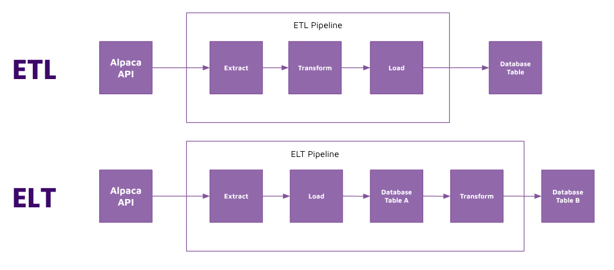

# ELT fundamentals 

## Concept 

Traditionally, data engineering follows an Extract Transform Load (ETL) pattern. However, in recent years, Extract Load Transform (ELT) has gained significant popularity. 

ELT is becoming more popular for the following reasons: 

- Cheaper storage: with cloud databases, storage costs have decreased significantly, and it is much more affordable to store more data in cloud databases. 

- Access to raw data: ETL provisions transformed data into the data warehouse. However, when new requirements arise, new pipelines have to be built to extract the data again. ELT avoids this hassle by storing raw data in the data warehouse. 

- Faster time to insights: most data analysts are able to work with data using SQL once it is in the warehouse. ETL creates a bottleneck where only data engineers with software skills can provision data. With ELT, both data analysts and data engineers can transform the data once it is in the warehouse, thereby removing the bottleneck. 

## Implement

We will implement ELT on Weather data using the following steps: 

1. Extract data from the Weather API 
2. Load data into a table in postgresql database (raw layer)
3. Transform the data using SQL and store the output in a new table in the postgresql database (staging layer)

When creating SQL tables, we prefer to use the `create table as` (CTAS) syntax to do so. 

This approach has the following advantages: 

- Create tables using a more declarative approach rather than imperative 
    - Imperative approach: “First create the table with X columns and Y data types.  Then execute a query to copy data from table A into table B” 
    - Declarative approach: “I want my tables to look like X” 
- Less steps to create table. 
- Infers data types from the upstream table. 

Note on SQL Style Guide: 

There are many different SQL styles you can use. I will be using my personal SQL style guide which is similar to [this style](https://github.com/mattm/sql-style-guide). 

