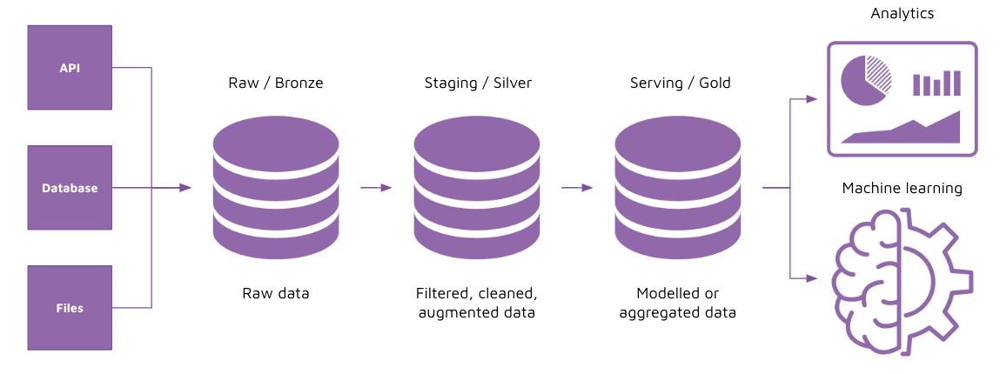

# ELT fundamentals 

## Task 

Implement ELT on stock price data from Alpaca API. Complete the notebook provided by referring to the comments in each cell. 

Steps: 

1. Create a secrets_config.py file to store your API key and secret 
2. Retrieve data for tesla between 2020-01-01 to 2020-01-02. Refer to these docs: 
    - Authentication: https://alpaca.markets/docs/api-references/trading-api/
    - API docs for trades: https://alpaca.markets/docs/api-references/market-data-api/stock-pricing-data/historical/#trades
3. Read trade data and exchange rate code data into dataframes
4. Create a connection to database 
5. Specify the trade data table schema 
6. Upsert data to trade table 
7. Upsert data to exchange codes table 
8. Perform data transformation using SQL: 
    - Create a staging table for trades and rename columns to more meaningful names 
    - Create a staging table for exchange codes
    - Create a serving table by joining staging_trades with staging_exchange_codes

