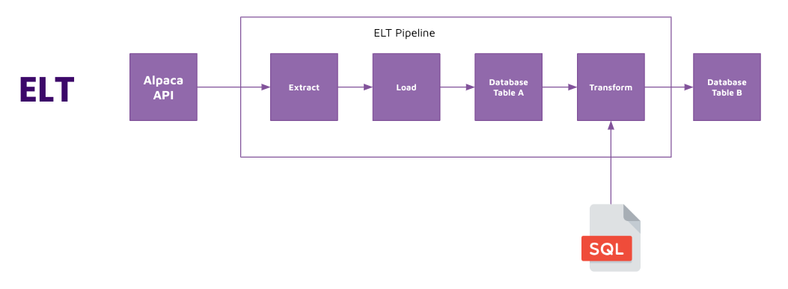
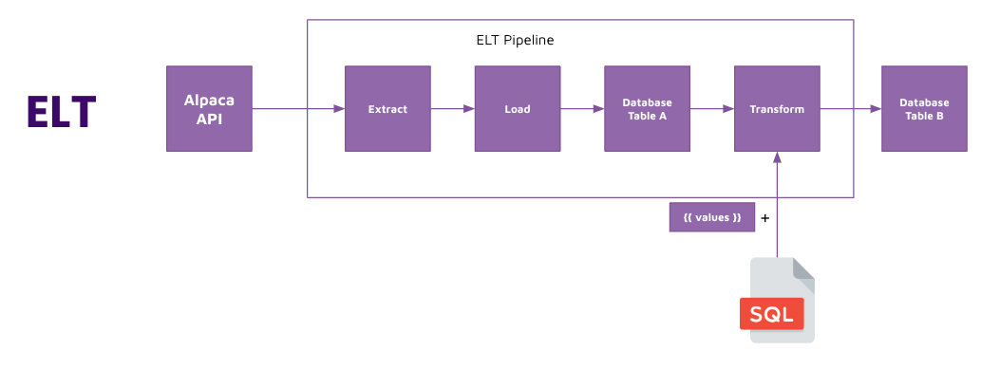

# SQL jinja

## Concept 

Now that we have seen how we can write SQL strings inside of Python, let's move these SQL strings into separate SQL files so that we get code intellisense and linting. 

In addition to that, we are going to take it a step further and introduce Jinja, a Python templating language that you can apply to any type of text file (commonly used with HTML and SQL). 

## Implement 

Simple SQL files: 
1. Take Python SQL strings and place them into a SQL file. 
2. Read the SQL file from Python and run against a database. 

SQL files with jinja templating: 
1. Add Jinja templating to the SQL file for `target_table`. 
2. Read the SQL file and render the value of `target_table` onto the SQL file contents using Jinja `render`. 
3. Run the rendered SQL code against a database. 