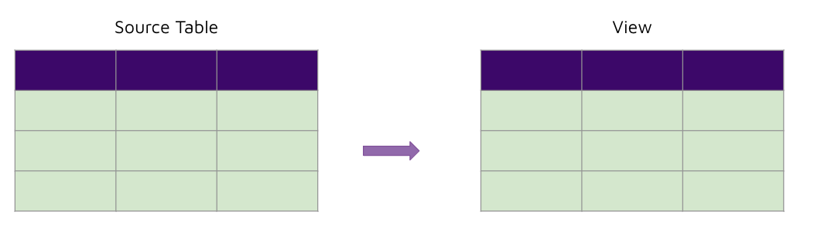
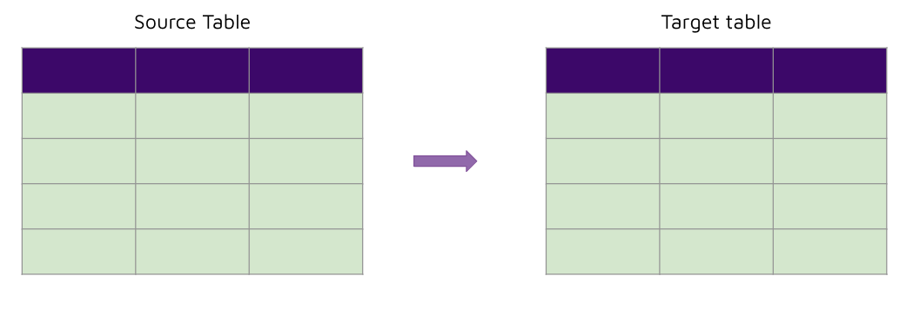
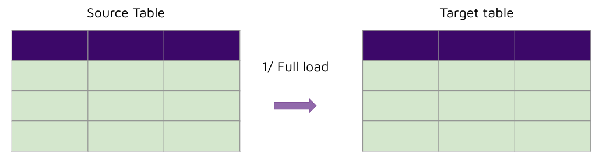
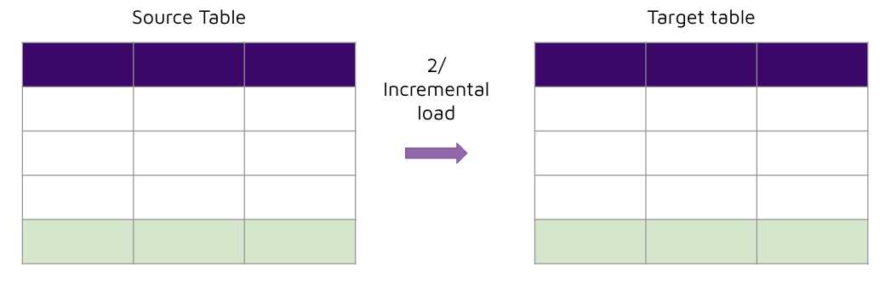
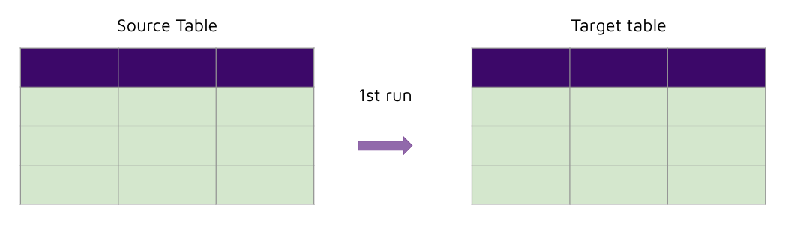
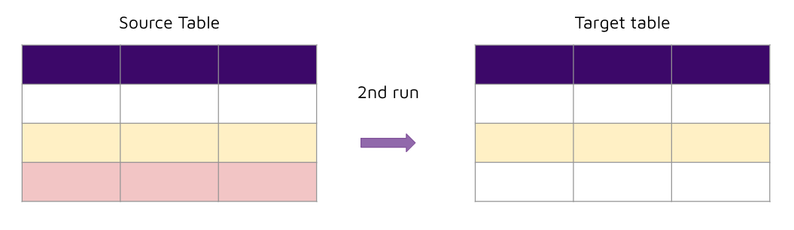
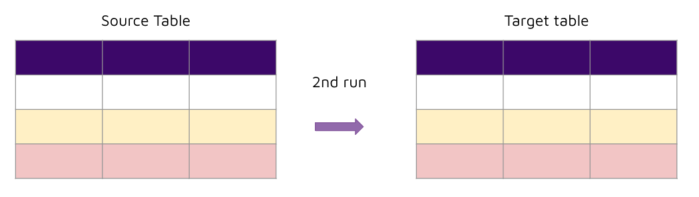

# Incremental models 

## Concept 

Object materialisation refers to how we create data objects in the database. There are several ways we can approach this: 

- Views
- Table - full load (CTAS)
- Table - incremental load
- Table - upsert load 
- Table - merge load 

Let's take a look at each one in more detail. 

### Views 



- This is the easiest method to create data objects in a database. 
- However, every time the view is queried, the entire view’s query would be ran again. This becomes an issue especially when the query logic is complex and time consuming. 
- Views should therefore be used for: 
    - Simple transformation logic 
    - Objects that are not queried with high frequency (unless the logic is extremely simple) 

### Table - full load (CTAS)



- Using CTAS, (re)creating tables is easily performed. 
- However, if the data volumes are very large, then recreating tables every time may not be feasible. 
- There is no need for a primary key for the target table. 

### Table - incremental load





- This approach involves perform a full load for the first run.
- Subsequent runs will materialise only newly added rows. 
- This approach works if there is a column we can use to check ever-incrementing values e.g. timestamp column. 
- This approach works well for very large data volumes, however it introduces complexity when the query logic changes or there is late arriving data, and rebuilds/backfilling needs to occur. 

### Table - upsert load 





- This approach involves inserting new rows or updating existing rows in the target table. 
- This approach requires a primary or unique key to exist in order to uniquely identify rows for the insert/update logic. 
- This method does not replicate rows that have been deleted in the source table.

### Table - merge load 




- This approach involves inserting, updating and deleting rows in the target table. 
- This method requires a primary or unique key to exist in order to uniquely identify rows for the merge logic (insert/update/delete). 

## Implement 

For this week, we shall focus only on: 
- Table full load (CTAS)
- Table incremental load 

This is because the approaches are the simplest and we get value without the need of having primary keys for our tables. 

Let's look at how we can implement incremental loads now. 

Implementing incremental loads broken down into steps: 

1. Check if the target table exists. 
2. If the target table does not exist (first load), then use CTAS to create the target table. 
3. If the target table already exists (subsequent load), then get the target_current_max_incremental_value from the target table, and use the following syntax structure to insert data into the target table: 

```sql
insert into target_table (
    select * 
    from source_table 
    where source_incremental_column > target_current_max_incremental_value
)
```
