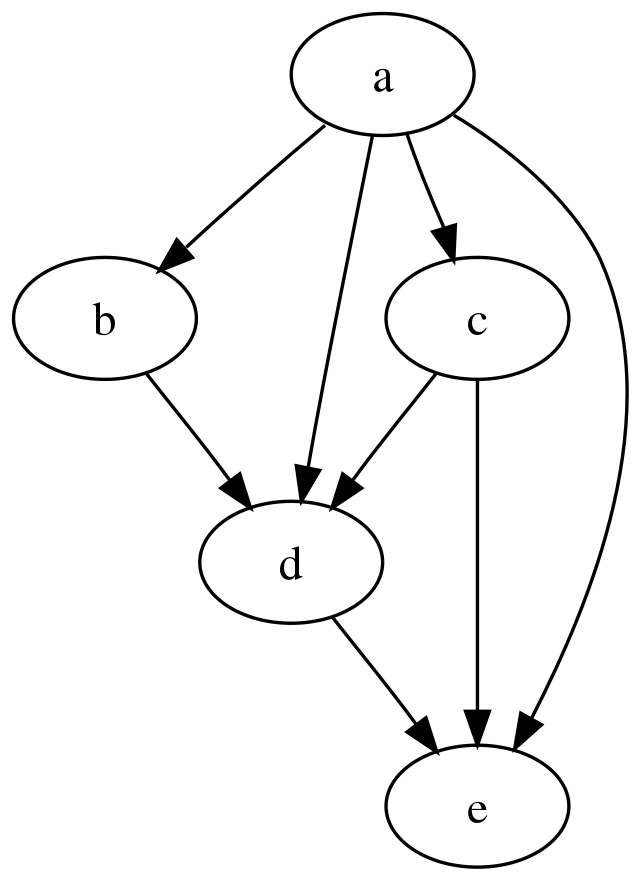

# Directed acyclic graphs (DAGs)

## Concept 

A Directed Acyclic Graph (DAG) is refers a set of directed nodes that do not have any cyclical dependencies (i.e. the directed nodes should not form a cycle).



We use DAGs in data engineering to represent workflows. In simple terms, is a collection of all the tasks you want to run, organized in a way that reflects their relationships and dependencies.

For example: 

```
extract >> load >> transform 
```

## Implement 

Let's look at how we can implement DAGs in Python using a built-in library known as `TopologicalSorter`. 
