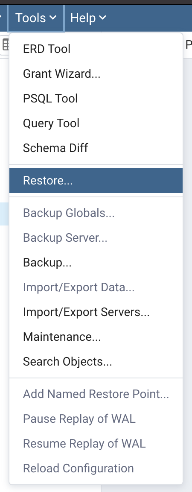
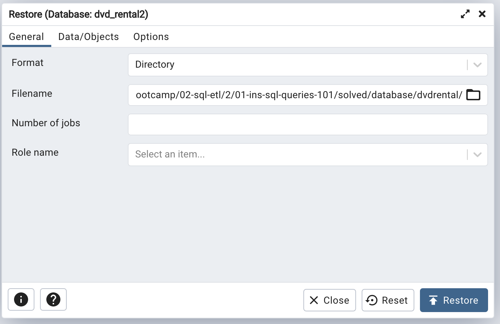
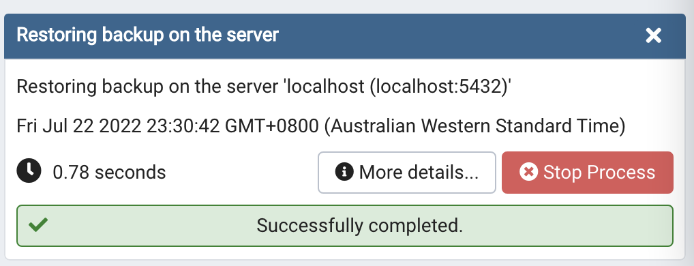

# SQL queries revision

## Concept

Today, we are going to dive deeper into advanced SQL queries (common table expressions and window functions) as they are the cornerstone to writing analytical queries for data analysis in SQL. 

But first, let's revise a couple of SQL concepts. The exercises we are going to be working with today is based on a DVD Rentals database. Please step through the instructions below to install the database, and review the database's Entity Relationship Diagram (ERD). 

## Installation

Follow the steps below to install the DVD Rentals database in your Postgresql instance. 

1. Select an existing server or create a new server 
2. Create a new database within your server, give it any name you wish e.g. `dvd_rental`
3. Select the database 
4. Select `Tools` > `Restore` 

5. Configure Restore: 
    - Change `Format` to "Directory"
    - Change `Filename` to the `database/dvdrental` folder in the instructions folder 

7. Select `Restore`. You should see a success message. 

## Implement 

After installing the database successfully, let's revise two fundamental SQL concepts: 

1. Aggregation queries 
2. Subqueries 