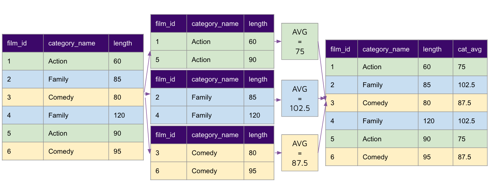

# Window functions 

## Concept 

A window function, also known as an analytic function, computes values over a group of rows and returns a single result for each row. 

With window functions you can compute moving averages, rank items, calculate cumulative sums, and perform other analyses. 

## Implement 


### Part 1: Solve using CTE

Let's first try to solve the following question using CTEs: "Compare each film's length to the avg_yearly_length and avg_category_length" 

The query we end up with looks like this: 

```sql
with films as (
	select 
		f.film_id, 
		f.title, 
		f.release_year, 
		f.length, 
		c.category_id, 
		c.name as category_name
	from 
		film f inner join film_category fc 
			on f.film_id = fc.film_id 
		inner join category c 
			on fc.category_id = c.category_id 
), release_year_length as (
	select 
		release_year, 
		round(avg(length),2) length 
	from 
		films 
	group by release_year 
), 
category_length as (
	select 
		category_id, 
		round(avg(length),2) length 
	from 
		films 
	group by category_id 
)

select 
	f.film_id,
	f.title,
	f.release_year, 
	f.category_name,
	f.length, 
	ryl.length as release_year_length, 
	cl.length as category_length
from 
	films f inner join release_year_length ryl  
		on f.release_year = ryl.release_year 
	inner join category_length cl 
		on f.category_id = cl.category_id 
order by f.film_id
```

The query we have written creates a set of partitions of data for the `release_year`, and another set of partitions of data for `category_length`. 

`release_year` named expression result  

```
| release_year | length |
| ------------ | ------ |
| 2006         | 115.27 |
```

`category_length` named expression result 

```
| category_name | length |
| ------------- | ------ |
| Action        | 111.61 |
| Animation     | 111.02 |
| Children      | 109.80 |
| Classics      | 111.67 |
| Comedy        | 115.83 |
| Documentary   | 108.75 |
| Drama         | 120.84 |
| Family        | 114.78 |
| Foreign       | 121.70 |
| Games         | 127.84 |
| Horror        | 112.48 |
| Music         | 113.65 |
| New           | 111.13 |
| Sci-Fi        | 108.20 |
| Sports        | 128.20 |
| Travel        | 113.32 |
```

Then we perform a join at the end to bring these numbers to generate the final table: 

Note: Only first 10 rows being displayed below. 

```
| film_id | title            | release_year | category_name | length | release_year_length | category_length |
| ------- | ---------------- | ------------ | ------------- | ------ | ------------------- | --------------- |
|       1 | Academy Dinosaur |        2,006 | Documentary   |     86 |              115.27 |          108.75 |
|       2 | Ace Goldfinger   |        2,006 | Horror        |     48 |              115.27 |          112.48 |
|       3 | Adaptation Holes |        2,006 | Documentary   |     50 |              115.27 |          108.75 |
|       4 | Affair Prejudice |        2,006 | Horror        |    117 |              115.27 |          112.48 |
|       5 | African Egg      |        2,006 | Family        |    130 |              115.27 |          114.78 |
|       6 | Agent Truman     |        2,006 | Foreign       |    169 |              115.27 |          121.70 |
|       7 | Airplane Sierra  |        2,006 | Comedy        |     62 |              115.27 |          115.83 |
|       8 | Airport Pollock  |        2,006 | Horror        |     54 |              115.27 |          112.48 |
|       9 | Alabama Devil    |        2,006 | Horror        |    114 |              115.27 |          112.48 |
|      10 | Aladdin Calendar |        2,006 | Sports        |     63 |              115.27 |          128.20 |
```


### Part 2: Solve using Window Functions

Now let's solve it using Window Functions. Rather than manually creating two partitions (or named expressions), we can use a window function to achieve the same result.


The two lines where this is done is: 

```
avg(f.length) over (partition by f.release_year) as release_year_length
avg(f.length) over (partition by f.category_id) as category_length
```

Full query: 

```sql 
with films as (
	select 
		f.film_id, 
		f.title, 
		f.release_year, 
		f.length, 
		c.category_id, 
		c.name as category_name
	from 
		film f inner join film_category fc 
			on f.film_id = fc.film_id 
		inner join category c 
			on fc.category_id = c.category_id 
) 
select 
	f.film_id,
	f.title,
	f.release_year, 
	f.category_name,
	f.length, 
	round(avg(f.length) over (partition by f.release_year), 2) as release_year_length,
	round(avg(f.length) over (partition by f.category_id), 2) as category_length
from films f 
order by film_id
```

SQL implements this feature through the following steps: 



1. Create partitions based on the partition key i.e. `(partition by category_id)`. This is similar to the group by clause in the CTE above. 
2. Perform the function prescribed in the over clause i.e. `avg(category_length) over` 
3. The resulting column will be given the name specified in the `as` clause i.e. `as category_length` 


We end up with the same result: 

```
| film_id | title            | release_year | category_name | length | release_year_length | category_length |
| ------- | ---------------- | ------------ | ------------- | ------ | ------------------- | --------------- |
|       1 | Academy Dinosaur |        2,006 | Documentary   |     86 |              115.27 |          108.75 |
|       2 | Ace Goldfinger   |        2,006 | Horror        |     48 |              115.27 |          112.48 |
|       3 | Adaptation Holes |        2,006 | Documentary   |     50 |              115.27 |          108.75 |
|       4 | Affair Prejudice |        2,006 | Horror        |    117 |              115.27 |          112.48 |
|       5 | African Egg      |        2,006 | Family        |    130 |              115.27 |          114.78 |
|       6 | Agent Truman     |        2,006 | Foreign       |    169 |              115.27 |          121.70 |
|       7 | Airplane Sierra  |        2,006 | Comedy        |     62 |              115.27 |          115.83 |
|       8 | Airport Pollock  |        2,006 | Horror        |     54 |              115.27 |          112.48 |
|       9 | Alabama Devil    |        2,006 | Horror        |    114 |              115.27 |          112.48 |
|      10 | Aladdin Calendar |        2,006 | Sports        |     63 |              115.27 |          128.20 |
```