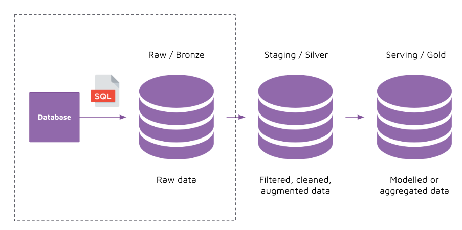

# Extract from database and load to database 

## Concept 

We have explored extracting data from APIs and files, and loading it to a database. 

Let's now explore how we can extract data from a database and load it to another database. 

When extracting data from a database, we use a SQL file to specify the SQL query we would like to use to extract the data. 

We *should* also explicitly specify the columns we wish to select rather than relying on a `select *` statement. With a `select *`, new columns were to be added, they would automatically appear in the raw tables. This could be a beneficial behaviour, but also a deterimental one if there is sensitive data (personally identifiable information) that is passing through that we are unaware of when we don't want it to. 

Being explicit also tells the data producer (source database), what columns you are relying on, thereby creating a data contract. As a data producer, they can run your SQL queries to validate that they are adhering to the data contract. If a column was dropped, the SQL query would throw an error. 

Whereas with a `select *`, if a column was dropped, the data producer would have no way of validating that you needed that column. 

## Implement 

1. Create a connection to the source database 
2. Extract data from the source database through a SQL query 
3. Hold the extracted data in-memory using a Pandas DataFrame
4. Create a connection to the target database 
5. Load the data from the Pandas DataFrame to the target database 
6. Create a pipeline that links the two steps and execute the pipeline 
