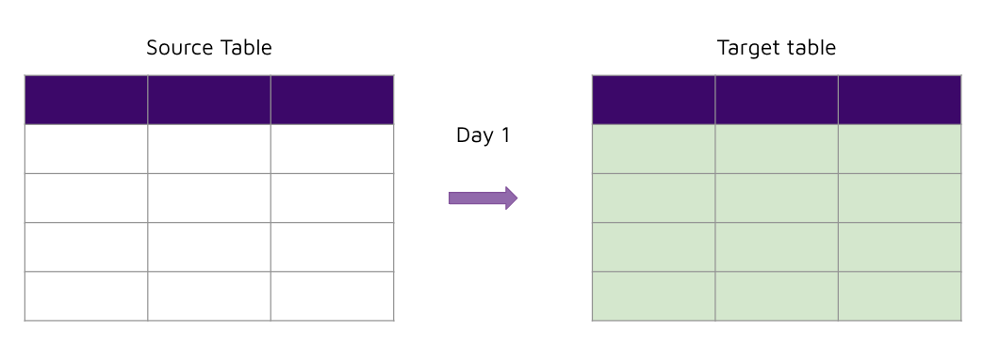
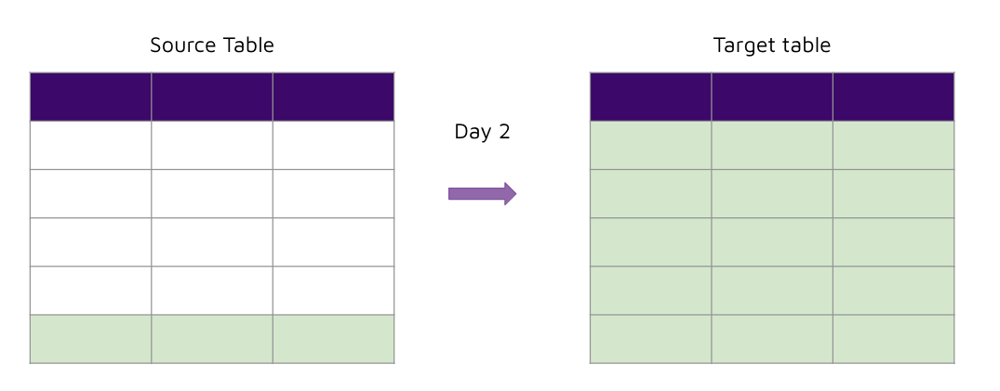
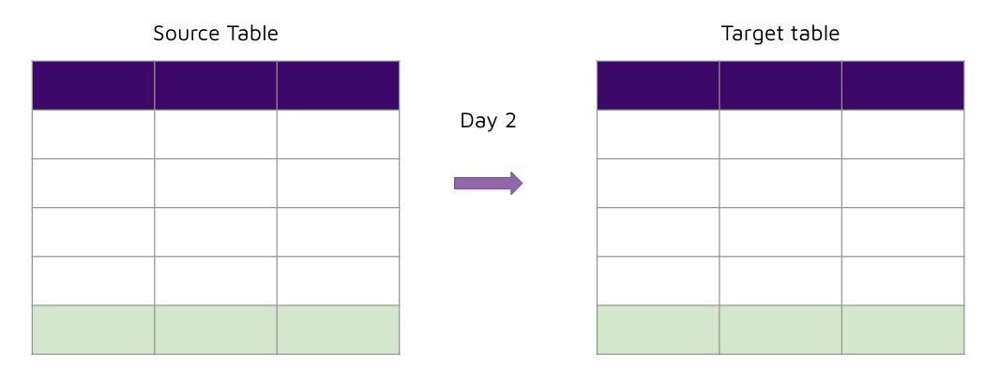

# Incremental extracts 

## Concept 

To understand the value of incremental extracts, let's first take a look at the current way we have been doing things - full extracts. 

### Full extracts





- This is the easiest method to replicate data from databases. 
- However, every time the pipeline is refreshed, it sends a query to the source database to retrieve all the rows. This becomes a problem when: 
    - The pipeline runs very often (e.g. 5-15 mins) 
    - The table has a huge volume of data 

This will introduce load on the source database which is being used by the end user application and could cause throttling, resulting in poor end user experience. 

### Incremental extracts




- Only extracts new rows that haven’t been previously ingested. 
- Requires the following: 
    - An incremental column to read from 
    - A way to store the latest incremental value 


## Implement 

To implement incremental extracts, first we modify our SQL files to the following: 

```sql 


select 
    orderid, 
    orderdate,
    customerid, 
    netamount,
    tax, 
    totalamount
from 
    {{ source_table }}


    where orderdate > '{{ incremental_value }}'

```

This keeps the SQL configuration and code declarative. The configuration on the SQL file will determine how our ingestion should be performed. 

Now we have to update our Python code to handle the new configuration. 

1. Check if `config["extract_type"]` is `incremental`. If it is, then: 
2. Get the `max(<incremental_column>)` value and store it in a CSV file for the next extract 
3. In the next extract, use the latest `incremental_value` in the sql `where` clause to only extract new records


We can still continue to perform full extracts for small tables to keep things simple. Thus we would have to modify our existing SQL files to the following: 

```sql


select 
    customerid, 
    firstname,
    lastname, 
    address1,
    address2, 
    city,
    state,
    country,
    region, 
    email, 
    phone,
    age,
    income,
    gender
from 
    {{ source_table }}
```


## Instructor-only (Setting up dellstore2)

1. Use psql to run a SQL migration script on a postgres database  

    Command: 
    ```
    psql -h <host_name> -d <database_name> -p <port> -U <username> -W -f <filename.sql>
    ```

    Example:
    ```
    psql -h localhost -d dellstore2 -p 5432 -U postgres -W -f dellstore2.sql
    ```

    See [psql usage docs](https://www.postgresql.org/docs/current/app-psql.html)
