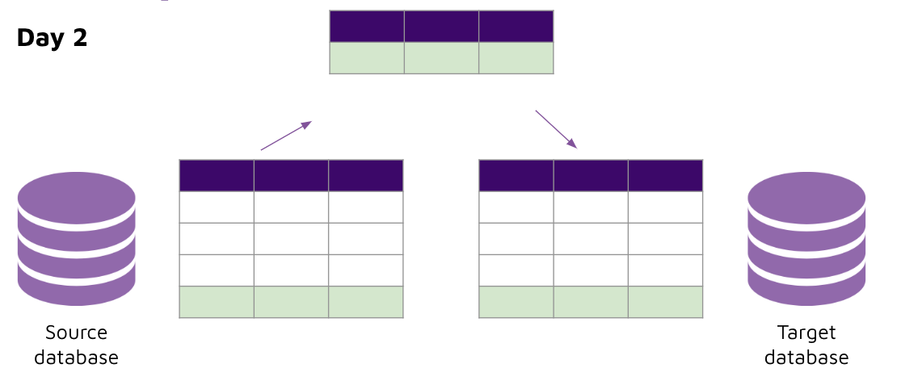

# Dynamic upsert load 

## Concept 

In the previous activity, we noticed that our target table is always being overwritten with only the latest data that was extracted. And if there was no data extracted, then our target table is empty! Why is this the case? 

### Incremental Extracts & Overwrite Loads


- This approach will always overwrite the target table with the data that was extracted. 
- This approach can work, but we would need to create another merge query in a staging table. 
- Alternatively, we could look to perform upserts of our data directly into the target table. 

### Incremental Extracts & Upsert Loads




- This approach will ensures that the existing data in the target table is not deleted. 


## Implement 

In week 1, Python ETL, we looked at the upsert method for loading. However the method we used previously required a table schema to be specified by the developer (i.e. you), for every table that is going to be upserted. 

```python
meta = MetaData()
stock_price_tesla_table = Table(
    target_table_name, meta, 
    Column("timestamp", String, primary_key=True),
    Column("exchange", String, primary_key=True),
    Column("price", Float),
    Column("size", Integer)
)
meta.create_all(target_database_engine)
```

This again adds more touch points for our code resulting in a very manual and slow process to integrate more tables. 

Is there a smarter way we can do this? Yes. Let's implement a dynamic upsert function in Python that infers the schema and data types from the data extracted. 

Before we jump in, let's first understand what the schema requires: 
- Table name 
- Column name 
- Column data type 
- Column primary key flag 

With that in mind, let's get coding: 

1. Get the table name from the SQL file 
2. Set a new config in the SQL file for the primary key columns 
3. Retrieve the key_columns config from the SQL file 
4. Retrieve the column and data types from the pandas dataframe 
5. Map pandas dataframe data types to the target database's data types 

