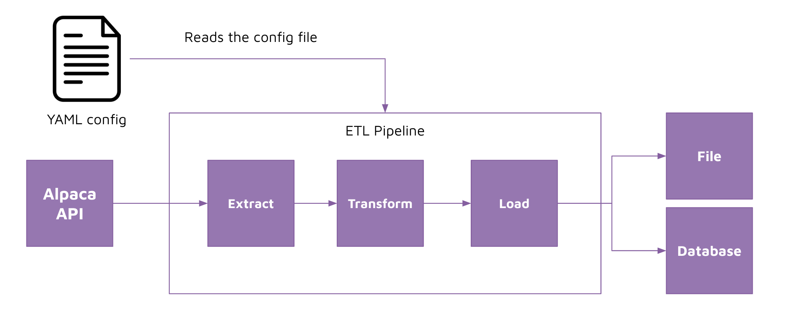

# Metadata config 

## Task 

Configure your ELT pipeline using a YAML file. 

We want to be able to easily control our ETL configuration through external toggles rather than inside of our Python file.

This makes it easy for other data engineers or even non-data engineers to change the settings of the ETL pipeline without having to fully understand what the code is doing.

Steps: 

1. Identify all areas of your code that a user should control
2. If there are any areas of your code that is not controllable but should be, then modify your python code so that the controls are configurable from the `pipeline()` function
3. Create a YAML file with all the necessary configuration that you want users to control
4. Test your code to make sure it works 

