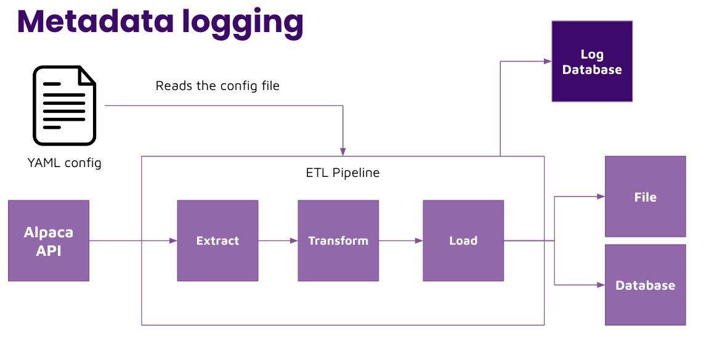

# Metadata logging 

## Task

Set up logging in the pipeline level and push logs to a logs database table. 

Steps: 
1. Make sure that the logging config is only set once at the pipeline level and no where else: `logging.basicConfig(stream=run_log,level=logging.INFO, format="[%(levelname)s][%(asctime)s]: %(message)s")`. Every where else should use `logging.info()` or `logging.error()`. 
2. Use the `MetadataLogging()` class and `StringIO()` class to store log buffers from week 1, and then push logs to a database. Refer to week 1's content if needed. 
3. Use a try-except statement around your entire pipeline logic 
4. Consider raising errors in your python code to trigger the `except` block and send log errors to a database  
5. Run the pipeline and validate that logs appear in the database
