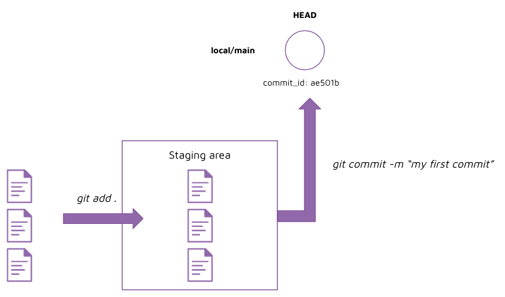

# Instruction

## Concept 

To save a new version of your repository, you will first need to **stage** your files. This tells git what files you would like to include in the new version. 

You can stage your files using a `git add .` command. 

After the files have been staged, you can create a new version by running `git commit -m "your_message"`.

The first commit will appear in the git logs. 



## Implement  

1. Create a new file `hello_world.py`
2. Write a new line in the file and save the file 
3. Commit the file

    1. check status 

        run: 
        ```
        git status 
        ```

        output: 
        ```
        Untracked files:
            (use "git add <file>..." to include in what will be committed)
                hello_world.py
        ```

    2. check log 

        run: 
        ```
        git log 
        ```

        output: 
        ```
        fatal: your current branch 'main' does not have any commits yet
        ```


    3. add the file to the staging layer 
    
        run: 
        ```
        git add . 
        git status 
        ```

        output: 
        ```
        Changes to be committed:
            (use "git restore --staged <file>..." to unstage)
                new file:   hello_world.py
        ```

    4. commit the file 

        run: 
        ```
        git commit -m "your_commit_message"
        git status 
        ```

        output: 
        ```
        nothing to commit, working tree clean
        ```

    5. check the log 

        run: 
        ```
        git log 
        ```

        output: 
        ```
        commit 1f8c2f525002c3729e1e5b21553bbc77e5672778 (HEAD -> main)
        Author: Jonathan Neo <myemail.com>
        Date:   Wed Aug 3 22:29:22 2022 +0800

            hello world
        ```

