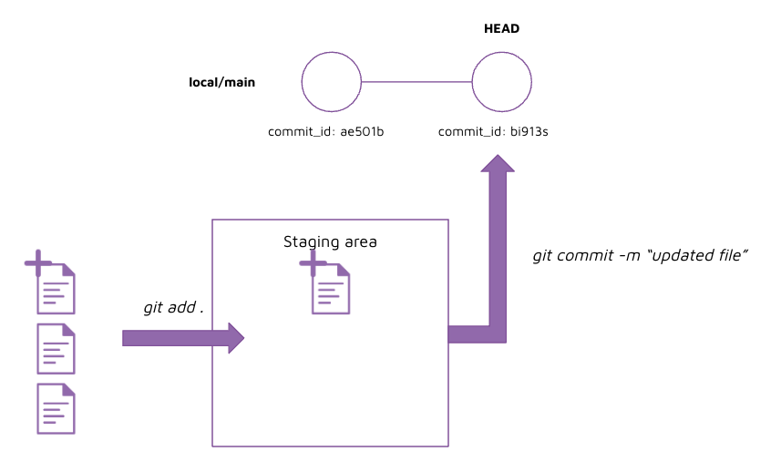

# Instruction 

## Concept 

You can also make changes to already committed files. You will simply need to perform a `git add .` again to tell git to include any changed files into the staging area. 

Then run a `git commit -m "your_message"` as before. Now git will create a new commit after the first one as shown by the git logs. 



## Implement 
1. Make a small change to the existing file 
2. Create a new file and make changes to it 
3. Commit all changes 

    1. check status 

        run: 
        ```
        git status 
        ```

        output: 
        ```
        Changes not staged for commit:
            (use "git add <file>..." to update what will be committed)
            (use "git restore <file>..." to discard changes in working directory)
                modified:   hello_world.py

            Untracked files:
            (use "git add <file>..." to include in what will be committed)
                bye_world.py
        ```

    2. check log 

        run: 
        ```
        git log 
        ```

        output: 
        ```
        commit 1f8c2f525002c3729e1e5b21553bbc77e5672778 (HEAD -> main)
        Author: Jonathan Neo <jonathanneo@me.com>
        Date:   Wed Aug 3 22:29:22 2022 +0800

            hello world
        ```


    3. add the file to the staging layer 
    
        run: 
        ```
        git add . 
        git status 
        ```

        output: 
        ```
        Changes to be committed:
            (use "git restore --staged <file>..." to unstage)
                new file:   bye_world.py
                modified:   hello_world.py
        ```

    4. commit the file 

        run: 
        ```
        git commit -m "your_commit_message"
        git status 
        ```

        output: 
        ```
        nothing to commit, working tree clean
        ```

    5. check the log 

        run: 
        ```
        git log 
        ```

        output: 
        ```
        commit 005a59d36b9bffc5eb96cad6f2098fc6c7797232 (HEAD -> main)
        Author: Jonathan Neo <myemail.com>
        Date:   Wed Aug 3 22:40:56 2022 +0800

            added bye world

        commit 1f8c2f525002c3729e1e5b21553bbc77e5672778
        Author: Jonathan Neo <myemail.com>
        Date:   Wed Aug 3 22:29:22 2022 +0800

            hello world
        ```

    6. going back to a past version 

        run: 
        ```
        git checkout <previous_commit_hash>
        ```

        output: 
        ```
        Note: switching to '1f8c2f525002c3729e1e5b21553bbc77e5672778'.

        You are in 'detached HEAD' state. You can look around, make experimental
        changes and commit them, and you can discard any commits you make in this
        state without impacting any branches by switching back to a branch.
        ```

    7. check the log 

        run: 
        ```
        git log 
        ```

        output: 
        ```
        commit 1f8c2f525002c3729e1e5b21553bbc77e5672778 (HEAD)
        Author: Jonathan Neo <jonathanneo@me.com>
        Date:   Wed Aug 3 22:29:22 2022 +0800

            hello world
        ```

    7. going back to the current version 

        run (to get back to the HEAD of main): 
        ```
        git checkout main 
        ```

        run (to checkout to the thing you did last): 
        ```
        git checkout - 
        ```

        output: 
        ```
        Previous HEAD position was 1f8c2f5 hello world
        Switched to branch 'main'
        Your branch is based on 'origin/main', but the upstream is gone.
            (use "git branch --unset-upstream" to fixup)
        ```

    8. check the log 

        run: 
        ```
        git log 
        ```

        output: 
        ```
        commit 005a59d36b9bffc5eb96cad6f2098fc6c7797232 (HEAD -> main)
        Author: Jonathan Neo <jonathanneo@me.com>
        Date:   Wed Aug 3 22:40:56 2022 +0800

            added bye world

        commit 1f8c2f525002c3729e1e5b21553bbc77e5672778
        Author: Jonathan Neo <jonathanneo@me.com>
        Date:   Wed Aug 3 22:29:22 2022 +0800

            hello world
        ```

