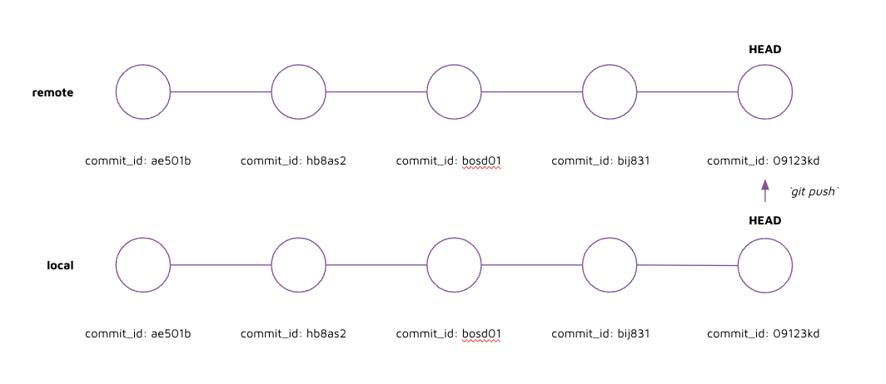

# Instructions 

## Concept 

To save commits to the remote, you will have to run `git push`. 

Pushing to the remote allows for other developers to view or download your code, if they have the permissions to do so. This enables team collaboration.



## Implement 

1. Go to github.com and verify that there are no files in the repository 

2. To push to remote, run: 

    ```
    git push 
    ```

3. Go to github.com and verify that the files have been pushed to github 

4. Click on the "[clock] commits" symbol to see the commit history 

