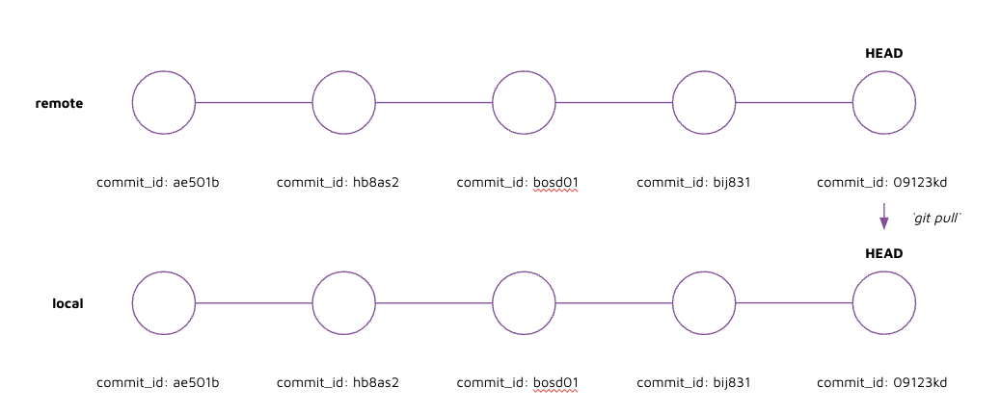

# Instruction 

## Concept

Git pull is the opposite of git push. Git pull is the command used to download commits from the remote. 



## Implement 

Make a commit directly in GitHub by: 
1. Click on "Add file" > create new file 
2. Write the following code in the editor and save as "hello_person.py"

    ```python 
    name = "your_name"
    print(f"hello there {name}")
    ```

3. Click on commit new file 
4. In the terminal, pull the latest changes by: 

    1. check the log 
    
        run: 
        ```
        git log 
        ```

        output: 
        ```
        commit 005a59d36b9bffc5eb96cad6f2098fc6c7797232 (HEAD -> main)
        Author: Jonathan Neo <jonathanneo@me.com>
        Date:   Wed Aug 3 22:40:56 2022 +0800

            added bye world

        commit 1f8c2f525002c3729e1e5b21553bbc77e5672778
        Author: Jonathan Neo <jonathanneo@me.com>
        Date:   Wed Aug 3 22:29:22 2022 +0800

            hello world
        ```

    2. git fetch to check if there are newer changes in the remote that isn't on local 

        run: 
        ```
        git fetch 
        ```

        output: 
        ```
        From https://github.com/jonathanneo/some-new-repo-02
        005a59d..03acfb9  main       -> origin/main
        ```

    3. git status 

        run: 
        ```
        git status 
        ```

        output: 
        ```
        Your branch is behind 'origin/main' by 1 commit, and can be fast-forwarded.
            (use "git pull" to update your local branch)
        ```

    4. git log 

        run: 
        ```
        git log 
        ```

        output: 
        ```
        commit 005a59d36b9bffc5eb96cad6f2098fc6c7797232 (HEAD -> main)
        Author: Jonathan Neo <jonathanneo@me.com>
        Date:   Wed Aug 3 22:40:56 2022 +0800

            added bye world

        commit 1f8c2f525002c3729e1e5b21553bbc77e5672778
        Author: Jonathan Neo <jonathanneo@me.com>
        Date:   Wed Aug 3 22:29:22 2022 +0800

            hello world
        ```

        Note: your branch hasn't been updated with the newest commit yet. Git fetch does not modify your commit history. 


    4. git pull 

        run: 
        ```
        git pull
        ```

        output: 
        ```
        Updating 005a59d..03acfb9
        Fast-forward
        hello_person.py | 2 ++
        1 file changed, 2 insertions(+)
        create mode 100644 hello_person.py
        ```

    5. git log 

        run: 
        ```
        git log
        ```

        output: 
        ```
        commit 03acfb953fad9635078b72f062f573cdf37ab5a1 (HEAD -> main, origin/main)
        Author: Jonathan Neo <jonathanneo@me.com>
        Date:   Wed Aug 3 22:58:05 2022 +0800

            Create hello_person.py

        commit 005a59d36b9bffc5eb96cad6f2098fc6c7797232
        Author: Jonathan Neo <jonathanneo@me.com>
        Date:   Wed Aug 3 22:40:56 2022 +0800

            added bye world

        commit 1f8c2f525002c3729e1e5b21553bbc77e5672778
        Author: Jonathan Neo <jonathanneo@me.com>
        Date:   Wed Aug 3 22:29:22 2022 +0800

            hello world
        ```

