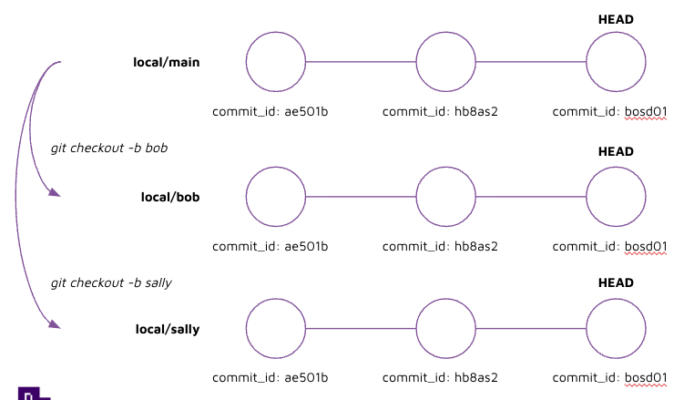

# Instruction

## Concept

If two developers were working together on the `main` branch, they would override each others work often. 

Creating separate branches allows developers to work on isolated versions of the code without impacting each other's work. 

Branches are generally created per feature, hence why they are also referred to as feature branches. 




## Implement 

1. Check branches 

    run: 
    ```
    git branch 
    ```

    output: 
    ```
    * main
    ```

2. Create a new branch 

    run: 
    ```
    git branch my-new-branch-1
    ```

3. Checkout to the new branch 

    run: 
    ```
    git checkout my-new-branch-1
    ```

    output:
    ```
    Switched to branch 'my-new-branch-1'
    ```

4. Checkout to another branch using a shortcut command 

    run: 
    ```
    git checkout -b my-new-branch-2
    ```

    output:
    ```
    Switched to a new branch 'my-new-branch-2'
    ```

    Note: The command above creates a new branch and checkout to the new branch. 


5. Add a new file, and modify an existing file 

6. Commit changes 

    run: 
    ```
    git add . 
    git commit -m "your_message_here"
    ```

7. Checkout to main branch 

    run: 
    ```
    git checkout main 
    ```

    Note: notice how the changes you have just made have disappeared! 

8. Checkout back to your feature branch 

    run: 
    ```
    git checkout -b my-new-branch-2
    ```

9. Push your changes to github 

    run: 
    ```
    git push 
    ```

    output: 
    ```
    fatal: The current branch my-new-branch-2 has no upstream branch.
    To push the current branch and set the remote as upstream, use

        git push --set-upstream origin my-new-branch-2
    ```

    Note: We receive an error because `my-new-branch-2` branch does not exist on the remote yet. 

    To create `my-new-branch-2` on the remote and push to it, you'll need to run:

    ```
    git push --set-upstream origin my-new-branch-2
    ```

    output: 
    ```
    To https://github.com/jonathanneo/some-new-repo-02.git
    * [new branch]      my-new-branch-2 -> my-new-branch-2
    branch 'my-new-branch-2' set up to track 'origin/my-new-branch-2'.
    ```

    Note: This creates `my-new-branch-2` on the remote, and tells git to track the local's copy of `my-new-branch-2` against the remote `origin/my-new-branch-2`.  

    Important: Once the upstream branch has been created and tracked, in future you only need to run `git push`. 
