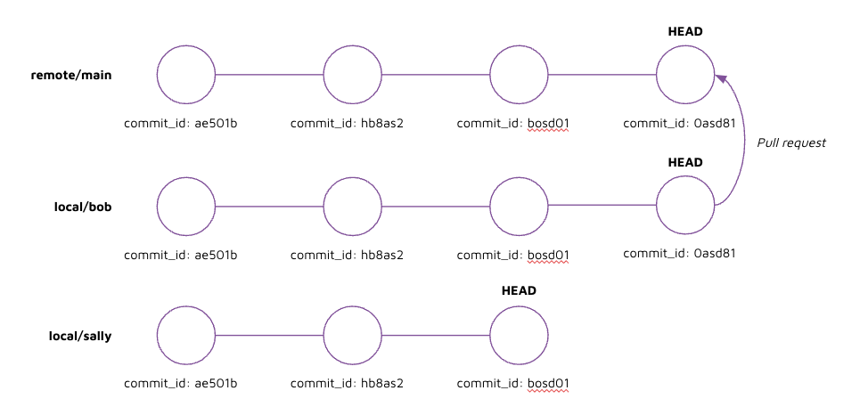
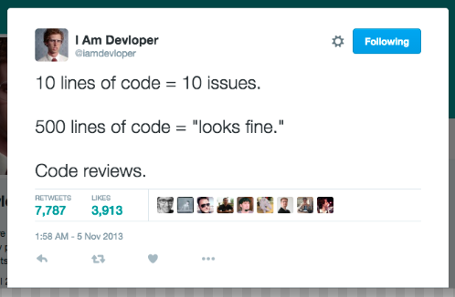

# Instruction 

## Concept 

How do we know which branch contains the working code? 

How do we implement safe software development practices? 

Pull requests a mechanism of safely bringing in changes back to the main branch by requesting for reviewers to perform a review on the remote branch. 



In the example above, Bob would have to request for Sally's review and approval before he can merge his code into main via a pull request. 

**Pull request guidelines**

- As a rule of thumb, keep code to <300 lines 



- Split larger PRs into smaller PRs 
- Try to include the following info in your pull request
    - Title (something clear and self-explanatory) 
    - Description
        - Overview 
        - Problem
        - Solution 

Google's code author and code reviewer's guide: https://google.github.io/eng-practices/

## Implement 

We will now introduce pull requests, which is a feature that only exists on the remote (i.e. github, gitlab, bitbucket). 

1. Create a new branch 

    run: 
    ```
    git checkout -b my-new-branch-3
    ```

2. Add a new file, change an existing file 

3. Commit and push the changes 

    run: 
    ```
    git add . 
    git commit -m "your_message"
    git push --set-upstream origin my-new-branch-3
    ```

    output: 
    ```
    * [new branch]      my-new-branch-3 -> my-new-branch-3
    branch 'my-new-branch-3' set up to track 'origin/my-new-branch-3'
    ```

4. Create pull request in github 
    - Click on "Pull requests"
    - Click on "New pull request"
    - Change the branch selector to: 
        - `base: main`
        - `compare: my-new-branch-3`
    - Select "Create pull request" 
    - Provide a title
    - Provide a description of the change 
    - Select "Create pull request" again 

    Note: 
    - We picked `base: main` because main is the default branch that is created for everyone. We only want to bring in clean code to the `main` branch. 
    - Ideally you should add a "Reviewer" too who will check the code before it gets merged into the `main` branch. But the reviewer will first need to have access to your repository. Let's assume that someone has already performed a review for us and "approved" our pull request. 
    - To invite a contributor to your repository see this [link](https://docs.github.com/en/account-and-profile/setting-up-and-managing-your-personal-account-on-github/managing-access-to-your-personal-repositories/inviting-collaborators-to-a-personal-repository).

5. Update the pull request description to contain: 
    - Title (something clear and self-explanatory) 
    - Description
        - Overview 
        - Problem
        - Solution 

6. Merge pull request 
    - Instead of performing a merge on your local repository to the main branch directly, we perform the merge on the remote. 
    - This allows us to add reviewers on the remote, which would not be possible if the repository was only stored locally. 
    - If the pull request is reviewed and approved, then we can merge the pull request by clicking on `Merge pull request` which performs a `merge` from the feature branch to the main branch on the remote. 

7. Delete branch 
    - Merged branches are generally no longer required and can be deleted to keep the branches clean. If needed again, you can restore the branch in github. 

