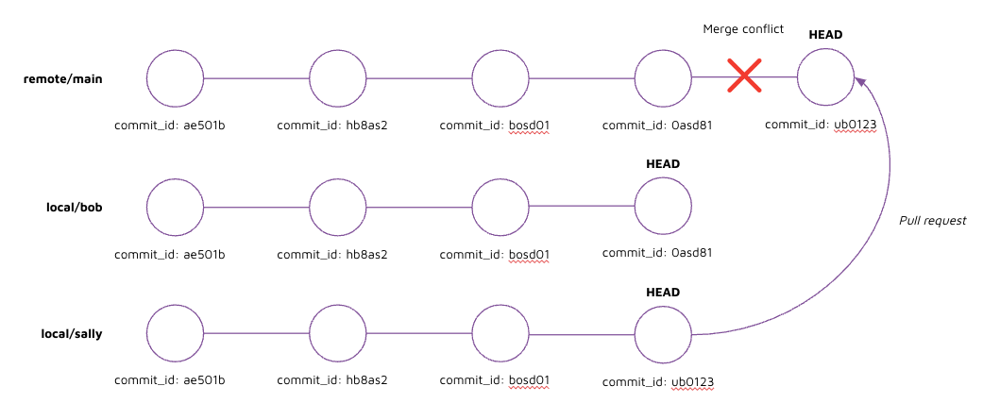

# Instruction

## Concept 

On occassion, when you try to merge a pull request, you will encounter a merge conflict. 




Merge conflicts happen when:
- people make different changes to the same line of the same file, or 
- when one person edits a file and another person deletes the same file.


## Implement 

1. Go to Github

2. Delete `color_world.py` file, and make a change to line 1 of `hello_world.py`. 

3. Commit the change directly in github on the `main` branch to mimic a change made by another person. 

4. On your local repository, create a new branch `my-new-branch-4`

5. Make a change to `color_world.py`, and make a change to line 1 of `hello_world.py`. 

6. Commit the changes and push to github 
    
    run: 
    ```
    git add . 
    git commit -m "your_message"
    git push --set-upstream origin my-new-branch-4
    ```

7. Create a pull request 

8. Notice that the pull request has a merge conflict and cannot be merged

9. Go back your local repository, get the latest version of main

    run: 
    ```
    git fetch 
    git checkout main 
    git pull main 
    ```

    output: 
    ```
    Fast-forward
    color_world.py | 2 --
    hello_world.py | 4 ++--
    size_world.py  | 2 ++
    3 files changed, 4 insertions(+), 4 deletions(-)
    delete mode 100644 color_world.py
    create mode 100644 size_world.py
    ```

10. Merge the newest `main` changes to `my-new-branch-4`

    run: 
    ```
    git checkout my-new-branch-4 
    git merge main 
    ```

    output: 
    ```
    CONFLICT (modify/delete): color_world.py deleted in main and modified in HEAD.  Version HEAD of color_world.py left in tree.
    Auto-merging hello_world.py
    CONFLICT (content): Merge conflict in hello_world.py
    Automatic merge failed; fix conflicts and then commit the result.
    ```

11. Resolve the merge conflict 

    The steps to resolving a merge conflict is simple. 

    1. Make the necessary fixes to the files by:
        - If a file was deleted in the remote, but you have changed it locally, then either leave it or remove it. 
        - If a file was changed in the remote, but you have deleted it locally, then either create it and make a change or leave it removed. 
        - If a line in a file was changed in the remote, and you have changed it locally, then make the appropriate change should be for that line. 
    2. Run `git add .`, `git commit -m "your_message"` to tell git that the merge conflict has been resolved 
    3. Run `git push` to push your branch to the remote 

12. Check github to verify that the merge conflict has been resolved and you are now able to merge your branch in the remote 

13. Merge the pull request 

