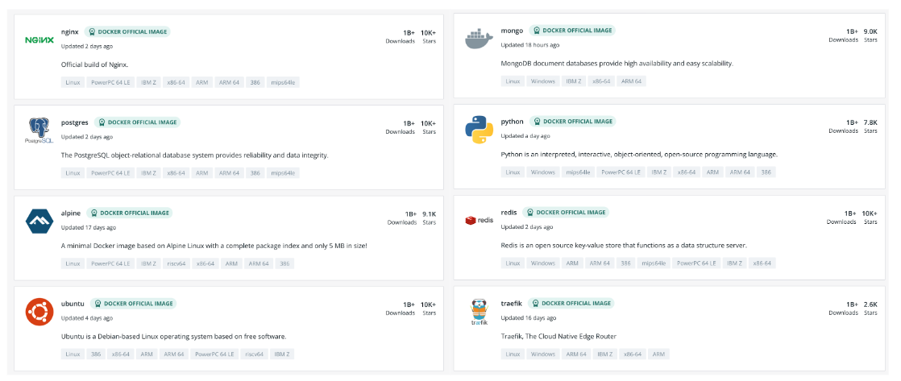
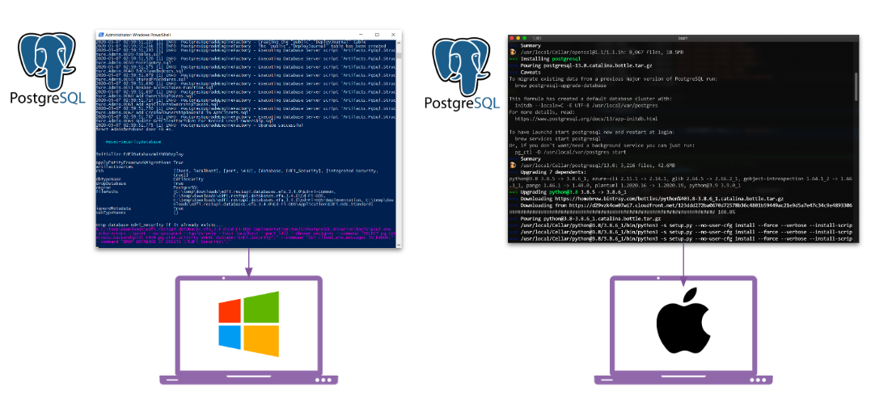
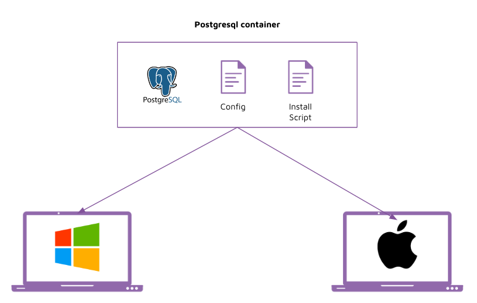
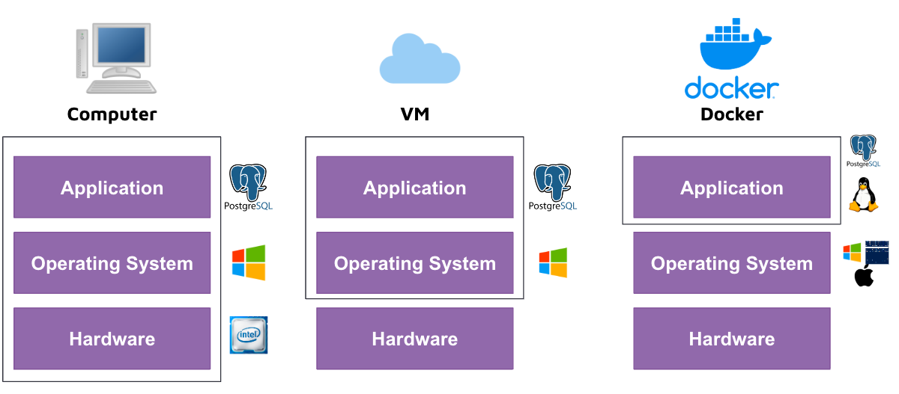

# Instruction 

## Concept 

**What is a container?**

- A Docker Container is a package that contains an application with all the necessary dependencies and configuration. 
- Simplify deployment regardless of whether the target environment is a private data center, public cloud, or your personal laptop. 

Examples of containers: 

**Installation before docker containers**

Before containers, you would have different software installation steps depending on the Operating System you choose. 

**Installation after docker containers**

With docker containers, you can now run the same software on any Operating System without worrying about different installation steps. 

**Deployment before docker containers**

A data engineer would provide code or a package to a cloud engineer for deployment. 

Their code may have been written on a Windows Computer, but it would not run on a Linux Operating System. 

**Deployment after docker containers**

With docker containers, a data engineer can write their code on a Windows Computer, and have it deployed to a Linux Operating System easily, thus making the lives of the cloud engineer a lot easier. 

**Computer vs VM vs Docker**

To understand how come docker containers are able to run on different operating systems, we first have to understand the differences between a computer, a virtual machine, and a docker container. 

## Implement 

1. Go to https://docs.docker.com/get-docker/
2. Select your Operating System 
3. Download the installer 
4. Run the installer 
