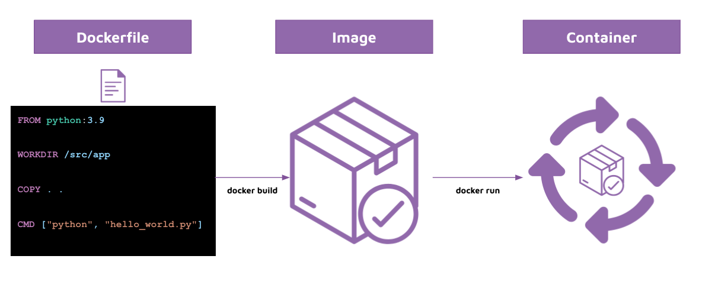

# Instruction

## Concept 

Let's run a docker container for a software that we are all too familiar with - postgres. 

To get the docker image for Postgres, we can go to https://hub.docker.com/ and search for postgres. 

We'll find [postgres](https://hub.docker.com/_/postgres) as the first result. 

Take a look at the dockerhub page and supported tags (versions) of postgres. 

Now, let's take a look at the latest version of postgres and see how the [image was created using a Dockerfile](https://github.com/docker-library/postgres/blob/2f6878ca854713264ebb27c1ba8530c884bcbca5/14/bullseye/Dockerfile). 



As we inspect the Dockerfile, we notice that the postgres image was built using `FROM debian:bullseye-slim`. 

All images in docker are built on top of base images e.g. `debian`, `centos`, `ubuntu`, and more. These are operating system images that runs on the linux kernel. 

In the same way, we'll be building off higher level abstractions of images e.g. the [python image](https://hub.docker.com/_/python). 

Let's now go ahead and run the postgres image on our computers. 

## Implement 

1. Execute `docker pull postgres:14` 

2. Execute `docker run postgres:14 --name my-postgres`. 

    You will receive an error saying that you are missing parameters such as `-e POSTGRES_PASSWORD=password`. 

3. Let's run again, this time using `docker run -p -e POSTGRES_PASSWORD=postgres --name my-postgres postgres:14`. This will run postgres on the terminal window you currently have open. 

4. We can run `ctrl + c` to kill the terminal (and consequently force stop the container). 

5. Let's try running it on in a detached mode using `-d` (i.e. run in the background). We can run `docker run -e POSTGRES_PASSWORD=postgres --name my-postgres -d postgres:14`. 

    You will receive an error saying that `The container name "/my-postgres" is already in use by container "<unique_hash_here>"`.

    You will first need to remove the conatiner by running `docker rm <unique_hash_here>`, and then run the command again. 

6. Now that the container is running in the background, we check all running containers by running `docker container ls` or `docker ps` (docker ps is the shortcut). 

7. Let's access the running postgres instance using PgAdmin4. 

    When we try to access the server, we notice that we are connecting to our old instance of postgresql. This is because docker defaults to using the same port `5432` which is already hosting our old version of postgresql database. Therefore we need to run docker with a new port.  

7. We can tell docker to use a new port that maps to the containers internal port by saying `-p 5433:5432`. This tells docker to run the container on port `5433` on our computer, and map it back to the containers port of `5432`. By doing this, we are now running docker on a non-conflicting port on our computer. 

    Let's first stop and remove our container. 
    
    Get container id: `docker ps` 

    Stopping container: `docker stop <container_id>` 

    Removing container: `docker rm <container_id>` 

8. Execute `docker run -p 5433:5432 -e POSTGRES_PASSWORD=postgres --name my-postgres -d postgres:14`. Now when we access the new postgres database using PgAdmin4, we are greeted with a brand new database. 


## Common docker commands 

```
# build a docker image  
docker build <directory> -t <image_name:image_tag>

# pull a docker image 
docker pull <image_name>

# show images
docker images 

# remove an image 
docker image rm <image_name:tag/image_id>

# run a container 
docker run <image_name>

# run a container in detached mode 
docker run -d <image_name>

# run a container with port mapping 
docker run -p <host_port:docker_port> <image_name>

# run a container with environment variables 
docker run -e <env_key=env_value> <image_name>

# show running containers 
docker ps 
docker container ls 

# stop container 
docker stop <container_id>

# remove container 
docker rm <container_id>
```