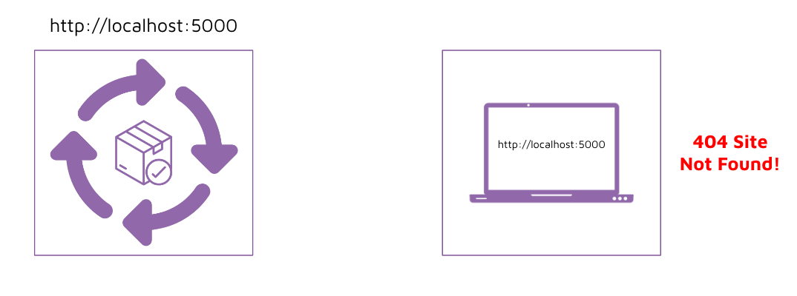
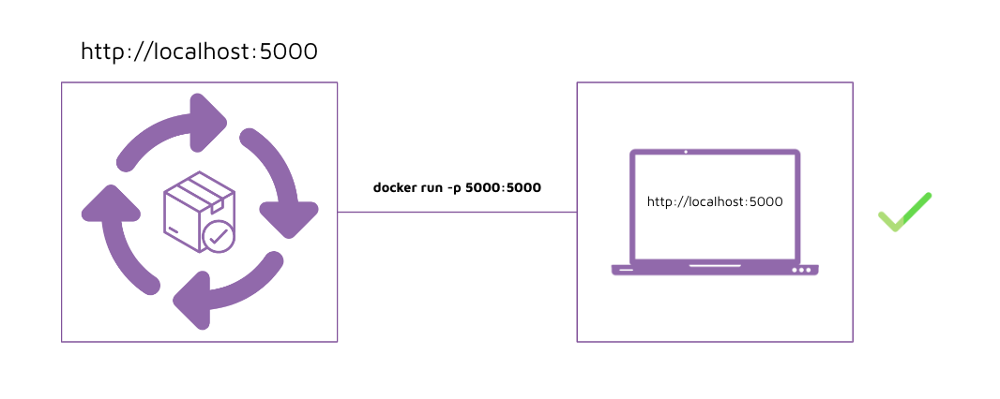
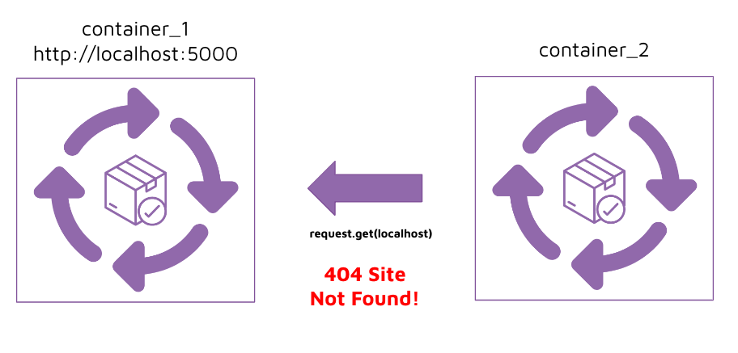
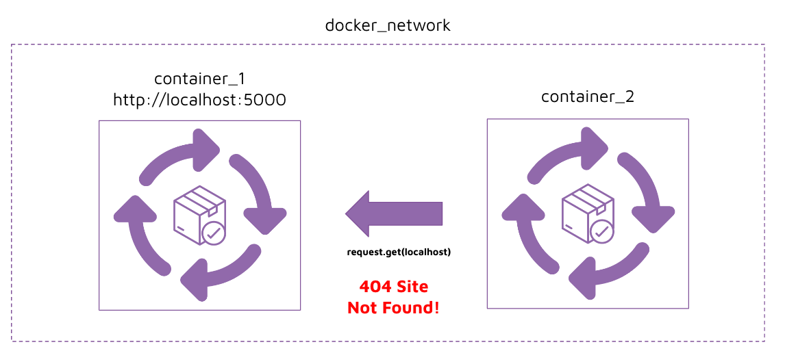
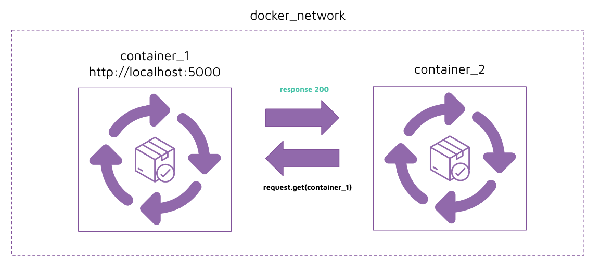

# Instruction 

## Concept 

### Docker ports

For a container's port to be accessible by your computer, we have to map the container's port to a port on your computer. 

**Without port**



**With port**



### Docker network 

For two containers to talk to each other we need to create a docker network. 

**Without network**



**With network**



However, even with a network, the containers still cannot reach each other. This is because `localhost` refers to each container's `localhost`. 

In order to refer to the IP address of another container, we should instead use the name of the container, and docker will handle the mapping to the target container. 

**With network and container name**




For two containers to talk to each other, we will need to create a docker network. 

## Implement 

Let's first try to get the containers to talk to each other without using a network. 

Build and run the api container: 
```
cd api
docker build . -t hello_world_api:1.0
docker run --rm -p 5000:5000 --name hello_world_api hello_world_api:1.0
```

Build and run the hello world container: 
```
cd hello_world
docker build . -t hello_world:1.0
docker run --rm -e API_ENDPOINT=localhost:5000 --name hello_world hello_world:1.0
```

We get an error message when running the last command because the IP address is not found: 
```
requests.exceptions.ConnectionError: HTTPConnectionPool(host='localhost', port=5000)
```

## Solution 

1. Take a look at our existing docker networks
    ```
    docker network ls 
    ```

2. Create a new docker network
    ```
    docker network create hello_world
    docker network ls 
    ```

3. Inspect the network and take note of the IPv4 address 
    ```
    docker network inspect hello_world
    ```

4. Run the api container in the docker network 
    ```
    docker run --rm -d -p 5000:5000 --network hello_world --name hello_world_api hello_world_api:1.0
    ```

5. Run the hello_world container in the docker network and pointing to the IPv4 address 
    ```
    docker run --rm -e API_ENDPOINT=<ip_address>:5000 --network hello_world --name hello_world hello_world:1.0
    ```

    Note: However, the IP address is dynamic and changes every time. How do we get the IP address to autoresolve itself so that we don't have to check it every time? 

6. Success! 
    ```
    Hello World!
    The random number of the day is:
    ___   _  _   
    / _ \ | || |  
    | (_) || || |_ 
    \__, ||__   _|
    /_/    |_|  
                
    ```

7. Run the hello_world container in the docker network and pointing to the target container's name. The IP address with autoresolve itself. 
    ```
    docker run --rm -e API_ENDPOINT=hello_world_api:5000 --network hello_world --name hello_world hello_world:1.0
    ```

    Note: `hello_world_api` in the endpoint will automatically resolve itself to the correct IP address of `hello_world_api`. 


8. Success again! 
    ```
    Hello World!
    The random number of the day is:
    ___   _  _   
    / _ \ | || |  
    | (_) || || |_ 
    \__, ||__   _|
    /_/    |_|  
                
    ```
