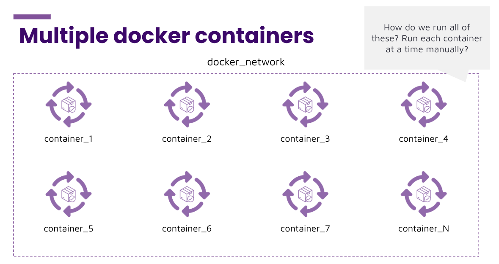

# Instruction 

## Concept 

From the previous activity, we had to run the following commands every time we wanted to run the two docker containers. 

```
docker network create hello_world
docker run --rm -d -p 5000:5000 --network hello_world --name hello_world_api hello_world_api:1.0
docker run --rm -e API_ENDPOINT=hello_world_api:5000 --network hello_world --name hello_world hello_world:1.0
```

What if we had 3, 4, 5... etc containers to run? It would be very time consuming running each command manually. Is there an easier way to run many containers at once? 



This is where docker compose comes in. 

## Implement 

We can run multiple docker containers using docker compose. 


```
# docker-compose.yml

version: "3"
services: 
  api: 
    image: hello_world_api:1.0
    container_name: hello_world_api
    ports: 
      - 5000:5000
  hello_world:
    image: hello_world:1.0
    depends_on: 
      - api 
    environment:
      - API_ENDPOINT=hello_world_api:5000
```

Note: docker compose takes care of the creation of networks for us. 

To start up all the containers we can run: 

```
docker compose up 
```


To stop and remove all the containers we can run: 

```
docker compose down 
```

