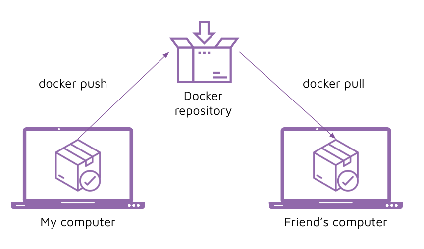

# Instruction

## Concept 

We can currently store images on our computer. But let's say we would like to store backup copies of the images on the cloud, or we would like to share images with our colleagues. How do we do that? 

That's where we can use a image repository. Docker Hub provides hosting for free public repositories, and 1 private repository. 



Let's look at how we can push our images to Docker Hub. 

## Implement 

1. Create a repository in [Docker Hub](https://hub.docker.com/). 

    Note: The repository should be the name of your image/container. Repository should map 1:1 to images. 

    Image versions will become different tags in the repository. 

2. Re-build or re-tag your image with your docker hub user and repository. 
    
    Re-build an image: 
    ```
    docker build -t <hub-user>/<repo-name>[:<tag>]
    ```

    OR, re-tag an existing image: 
    ```
    docker tag <existing-image> <hub-user>/<repo-name>[:<tag>]
    ```

3. Login to docker hub 

    If you are already logged in with a different user, you can logout first: 
    ```
    docker logout
    ```

    To login: 
    ```
    docker login 

    # provide your docker_id as the username 
    # provide your password 
    ```

4. Push the image to the repository 

    Run a docker push 
    ```
    docker push <hub-user>/<repo-name>:<tag>
    ```

5. Try out docker pull 

    ```
    docker pull <hub-user>/<repo-name>:<tag>
    ```

    Note: if your repository is public, then anyone can pull the image you've built. 


