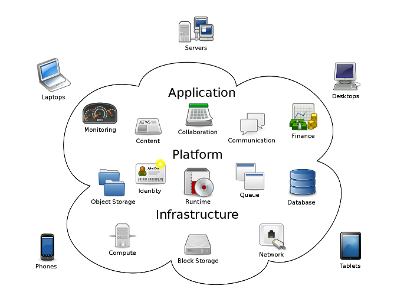
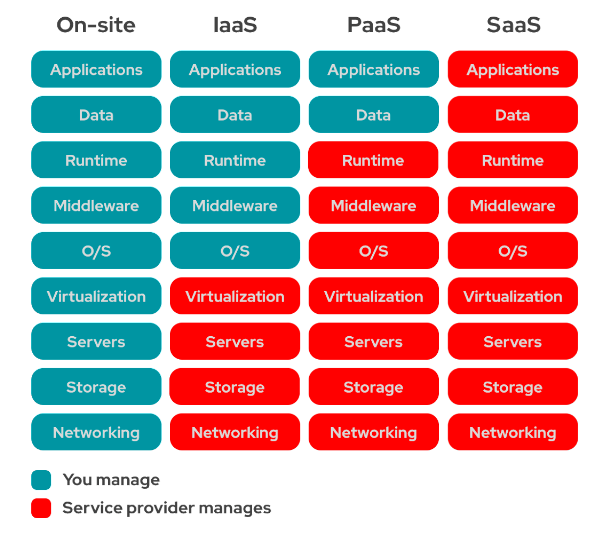

# Instruction 

## Concept

The cloud consists of many services you can rent such as: 
- Applications: calendar applications (e.g. Google calendar), accounting applications (e.g. Xero, MYOB)
- Platform: databases (e.g. MySQL, PostgreSQL), File storage (e.g. Azure Data Lake, AWS S3, Google Cloud Store)
- Infrastructure: compute (e.g. Azure VM, AWS EC2), hard disk drives, network interface cards 

The benefit of using the cloud is that it takes away a lot of the pain and costs with setting up a physical on-site infrastructure in order to use the services we mentioned before. 

The cloud allows you to pick and choose how much or how little support you wish to consume: 
- IaaS: The cloud provider allows you to deploy and configure: virtual machines, hard disks, network interface cards. These are services you can lease on the cloud provider's data centre. 
- PaaS: The cloud provider allows you to deploy and configure: databases, file storage systems, application hosting services. 
- SaaS: The cloud provider allows you to configure or consume: user access, APIs. You are basically buying a software. 

For our course, we are going to be using AWS. AWS provides a comprehensive free tier that will allow us to do a lot without cost to ourselves. 

Cloud concepts are transferrable between cloud providers (AWS, Azure, GCP).

## Steps 

1. Go to https://aws.amazon.com/free
2. Click on Create a free account 
3. Provide personal and credit card details 
    Note: AWS will perform a penny test. $1 will be charged to your credit card, and then refunded. This is to validate the authenticity of your credit card. 

