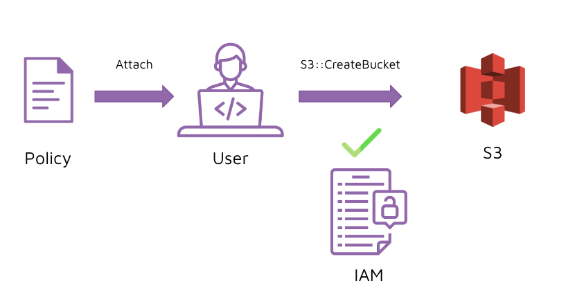

# Instruction 

## Concept 

- IAM controls the creation of Users
- IAM controls the access to Resources
- Resources are services you create in AWS e.g. RDS, S3, EC2 
- Users perform Actions on Resources e.g. S3::CreateBucket 
- Authorization for a user to perform an Action is based on a Policy



## Implement 

### Create user

1. Go to IAM 
2. Select "Users" 
3. Select "Add user" 
4. Provide a username 
5. Under "Select AWS credential type", tick both "Access key" and "Password" 
6. Provide a temporary password (store somewhere securely)
7. Click on "Next: permissions" 
8. Click on "Next: tags"
9. Click on "Next: review" 
10. Click on "Create user"

### Create S3 bucket with new user 

1. Go to S3 and try to create a new bucket 

    Note: "bob" does not have permissions to create a new S3 bucket 

### Create policy 

1. Go to AWS IAM
2. We can either use an existing policy or create a new one. Let's create a new one. 

    ```json 
    {
        "Version": "2012-10-17",
        "Statement": [
            {
                "Effect": "Allow", 
                "Action": ["s3:*", "s3-object-lambda:*"], 
                "Resource": "*"
            }
        ]
    }
    ```

3. Save the policy with the name "S3AllowAll"

### Add policy to user 

1. Go to User 
2. Select "bob" 
3. Select "Add permissions" 
4. Select "Attach existing policies directly" 
5. Select "S3AllowAll"
6. Select "Review"
7. Select "Add permissions"

