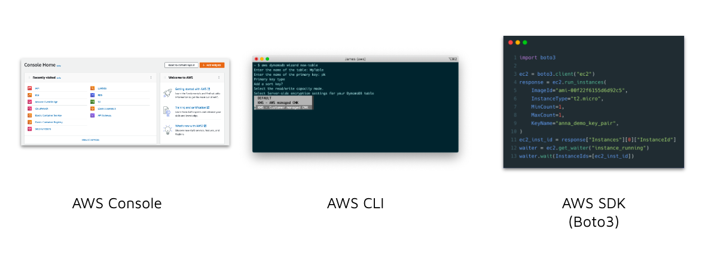

# Instruction

## Concept 

AWS offers 3 main interfaces for developers to deploy and configure cloud services. 

1. AWS console 
2. AWS CLI 
3. AWS SDK (Boto3 for Python users)



We've already covered AWS Console. Let's now take a look at AWS CLI.

## Implement 

### Install AWS CLI 

1. Go to https://aws.amazon.com/cli/
2. Download and install the CLI 

### Login to AWS CLI 

1. Read `aws configure` docs: https://docs.aws.amazon.com/cli/latest/userguide/cli-configure-quickstart.html 
2. Run `aws configure`: 
    - AWS Access Key ID: `<provide_your_aws_access_key_id>` - you can obtain this from AWS IAM 
    - AWS Secret Access Key: `<provide_your_aws_secret_access_key>` - you can obtain this from AWS IAM 
    - Default region name: `<provide_your_closest_region>` e.g. ap-southeast-2 for Sydney 

### Create a new S3 bucket 

1. Run the following command to create a new S3 bucket using the CLI: 

    ```
    aws s3api create-bucket --bucket <your_bucket_name> --acl public-read --region <your_region_name> --create-bucket-configuration LocationConstraint=<your_region_name>
    ```

    Note: Refer to the [docs](https://docs.aws.amazon.com/cli/latest/reference/s3api/create-bucket.html) on how to use the `s3api` commands.  

### Copy files to S3 

1. Read `aws s3` docs: https://docs.aws.amazon.com/cli/latest/reference/s3/ 
2. Copy only `.csv` files from your local to s3: 

    Run: 
    ```
    cd /instruction
    aws s3 cp ./files s3://your_bucket/ --recursive --exclude "*" --include "*.csv" 
    ```

    Output: 
    ```
    upload: files/folder1/file1.csv to s3://your_bucket/folder1/file1.csv
    upload: files/folder1/file2.csv to s3://your_bucket/folder1/file2.csv
    upload: files/folder1/file3.csv to s3://your_bucket/folder1/file3.csv
    ```

