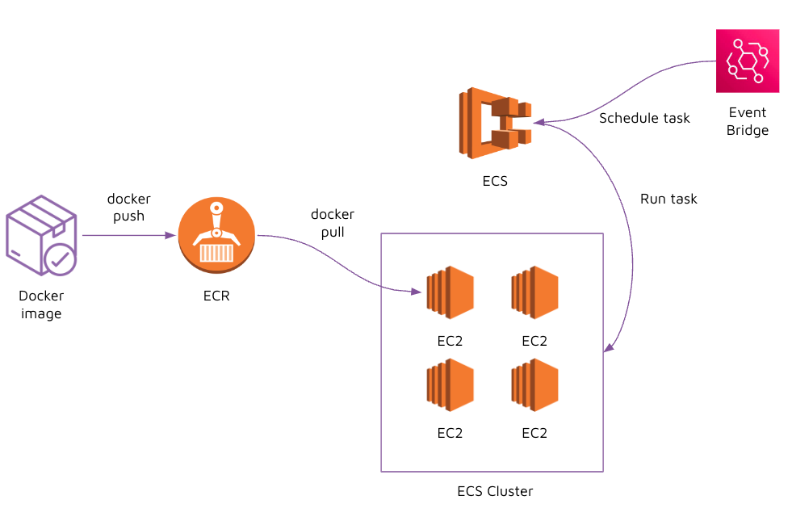

# Instruction

## Task

You are to create and ECS cluster and run a task on a schedule. Do not worry if you haven't learnt how to run tasks on a schedule yet, it's really simple, and you'll get to it at the end of these instructions! 

### Create a ECS cluster 

1. Search for "ECS" in AWS Console 
2. Select "Create cluster" 
3. Select "EC2 Linux + Networking", and select "Next step" 
4. Configure cluster; 
    - Cluster name: `<provide_a_name>` 
    - Provision Model: `[x] On-Demand Instance` 
    - EC2 instance type: `t2.micro` (**important**: select `t2.micro` to make use of AWS Free Tier and avoid any costs)
    - Number of instances: `1` 
    - Networking: 
        - VPC: select your existing VPC (every AWS account has a VPC created by default)
        - Subnets: select any existing Subnet (every AWS account has a VPC and subnets created by default). 
        - Security group: select the existing default security group 
    - Container instance IAM role: `Create new role` 
5. Select "Create" 

### Review cluster 

- `Tasks`: One-off tasks that are runninng on EC2 instances. 
- `Scheduled tasks`: Tasks that run on a schedule on EC2 instances. 
- `ECS Instances`: EC2 instances that has been created. 
- `Services`: A long-running service (e.g. API, Web Application) that runs on EC2 instances. 

### Create task definitions 

1. On the left panel, select "Task definitions" 
2. Select "Create new Task Definition" 
3. Select "EC2" > "Next step": 
    - Task definition name: `<provide_a_name>`
    - Task role: `None` 
    - Network mode: `default` 
    - Task memory (MiB): `128`
    - Task CPU (unit): `1 vCPU` 
    - Container definitions > Select "Add container":   
        - Container name: `<provide_a_name>`
        - Image: `<copy_image_uri_from_ecr>` 
        - Private repository authentication: [ ]  (leave unchecked)
        - Memory limits (MiB): [ ] (leave empty)
    - Click "Add" 
    - Click "Create" 

### Run a task (one-off)

1. Go to your cluster > select "Tasks"
2. Select "Run new Task": 
    - Launch type: `"EC2"` 
    - Task Definition: `<select_your_task_definition>` 
    - Number of tasks: `1`
3. Select "Run Task"
4. Verify 

### Bonus: Create a scheduled task 

1. In ECS, select your cluster
2. Select "Scheduled Tasks" > "Create": 
    - Schedule rule name: `<provide_a_name>` 
    - Run at fixed interval: e.g. `2 minutes` 
    - Target id: `<provide_a_name>` 
    - Task Definition: `<select_your_task_definition>` 
    - Select "Create" 

