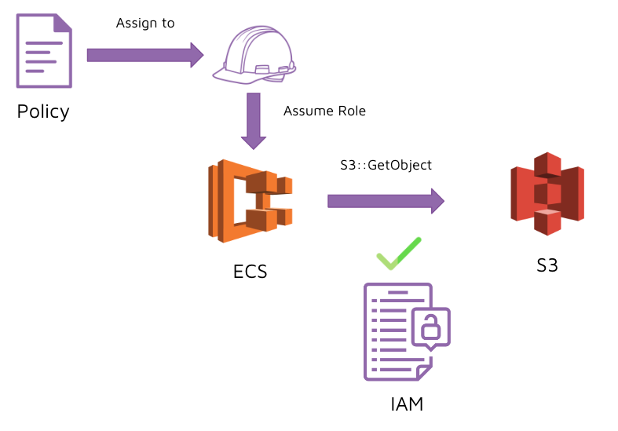
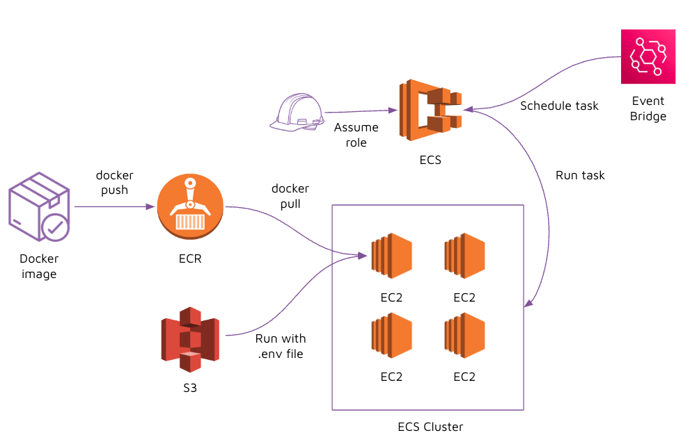

# Instruction 

## Concept 

Let's wrap up our lesson on ECS: 
- Scheduled tasks 
- Dealing with `.env` secrets 

For ECS to access `.env` files stored on S3, we will need to grant ECS a role. 

Roles are used by AWS Services to receive permissions to perform a task e.g. `S3::GetObject`. 



For this demo, we will create a new role for ECS to access the `.env` files on S3. 




## Implement 

### Create scheduled tasks 

1. In ECS, select your cluster
2. Select "Scheduled Tasks" > "Create": 
    - Schedule rule name: `<provide_a_name>` 
    - Run at fixed interval: `2 minutes` 
    - Target id: `<provide_a_name>` 
    - Task Definition: `<select_your_task_definition>` 
    - Select "Create" 


### Remove ENV variables from Dockerfile 

1. Remove all secret ENV variables from the Dockerfile 

### Rebuild the docker image and push to ECR 

1. Retrieve an authentication token and authenticate your Docker client to your registry.
    
    Use the AWS CLI:
    ```
    aws ecr get-login-password --region <your_region> | docker login --username AWS --password-stdin <your_ecr_uri> 
    ```

    Note: The above command assumes you have already logged in to AWS CLI using `aws configure`. 

2. Build your Docker image using the following command.

    ```
    docker build -t dellstore 
    ```

3. Tag your docker image. 
    
    ```
    docker tag dellstore:latest <your_ecr_uri>/dellstore:latest
    ```

4. Push your docker image. 

    ```
    docker push <your_ecr_uri>/dellstore:latest
    ```


### Upload env file to S3 

1. Create a new bucket that is `private` (**important**: the bucket has to be private so that no one can steal your credentials)
2. Upload the `.env` file to the S3 bucket 

### Create new role for ECS to access S3 files 

1. Go to IAM 
2. Select "Roles" 
3. Select "Create role" 
4. Select "AWS service": 
    - Use case: "Elastic Container Service" > "[x] Elastic Container Service Task"
5. Under "Permissions policies", select "AmazonECSTaskExecutionRolePolicy". Select "Next". 
6. For role name, provide a name that relates to the ECS Task Definition e.g. DellstoreETL
7. Select "Create role" 
8. Go to the newly created role 
9. Select "Add permissions" > "Create inline policy" > "JSON"

    Add the below in-line policy: (note you will have to update examplebucket, folder_name and env_file_name accordingly)

    ```json 
    {
        "Version": "2012-10-17",
        "Statement": [
            {
            "Effect": "Allow",
            "Action": [
                "s3:GetObject",
                "s3:GetBucketLocation"
            ],
            "Resource": [
                "arn:aws:s3:::examplebucket/folder_name/env_file_name"
            ]
            },
            {
            "Effect": "Allow",
            "Action": [
                "s3:GetBucketLocation"
            ],
            "Resource": [
                "arn:aws:s3:::examplebucket"
            ]
            }
        ]
    }
    ```
10. Select "Review policy" 
11. Provide a name for the policy e.g. ReadS3EnvFile
12. Select "Create policy" 

### Use env file in ECS 

1. In ECS, go to "Task Definitions" 
2. Select the existing task and task revision
3. Select "Create new revision"
4. Under Task role, select the role you have created earlier
5. Under Task execution IAM role, select the role you have created earlier
5. Select your container name e.g. `dellstore_container` 
6. Select Environment files "+" 
    - Source: `S3 ARN` 
    - Location: `<copy_object_arn_from_s3>` e.g. `arn:aws:s3:::my_bucket/.env` 
7. Select "Create" 

For more see [AWS ECS docs here](https://docs.aws.amazon.com/AmazonECS/latest/developerguide/taskdef-envfiles.html).

### Update scheduled task to use new task definition revision

1. Go to ECS > Scheduled tasks and select your scheduled task 
2. Edit the scheduled task 
3. Select the target and change the revision to the latest
4. Select "Update" 

