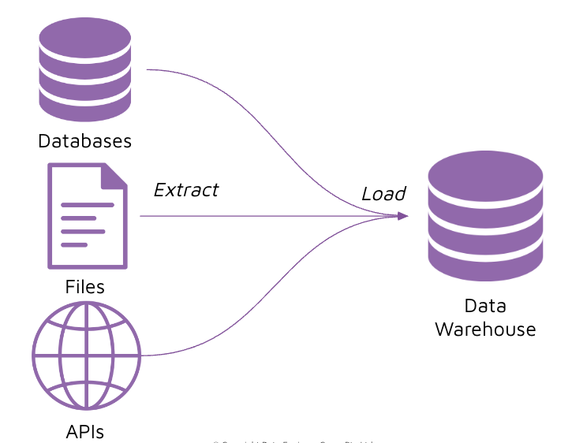
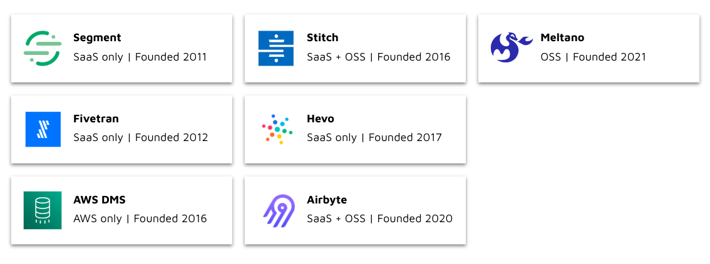
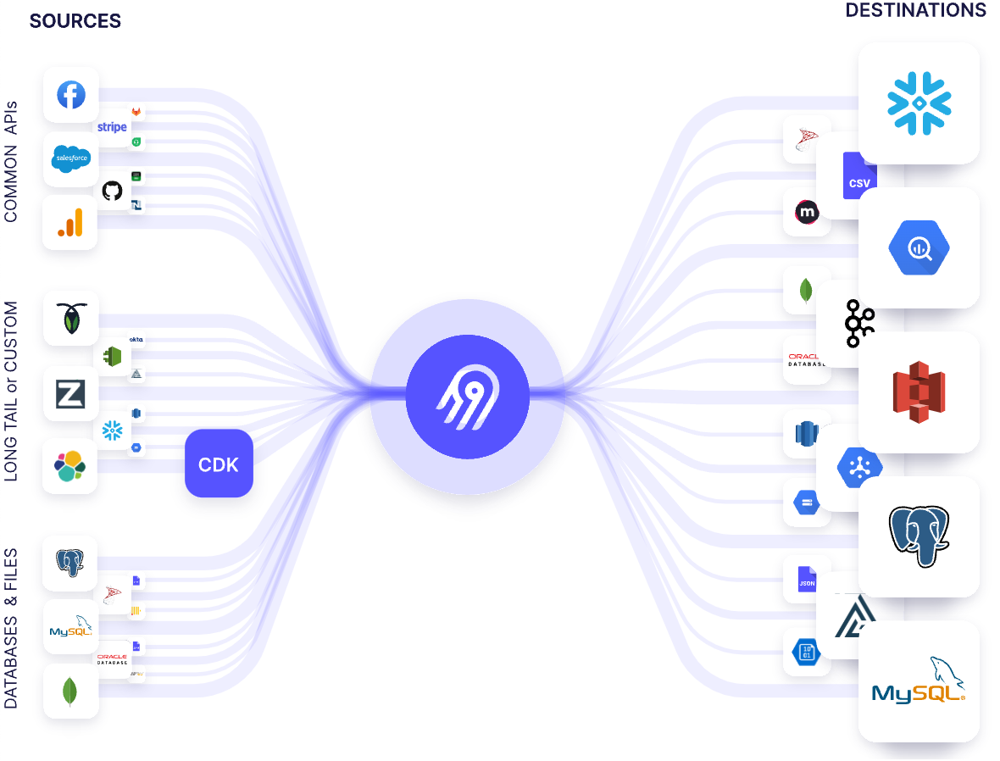
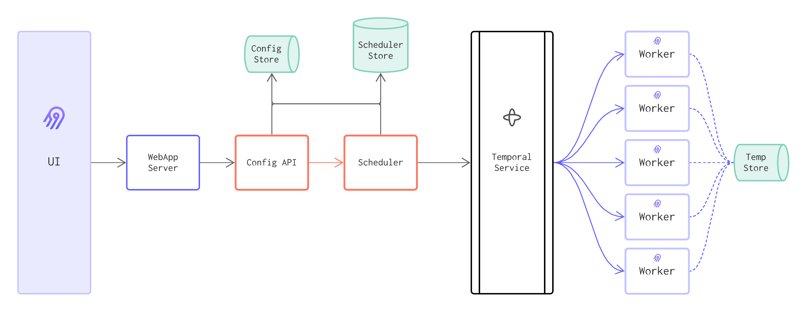
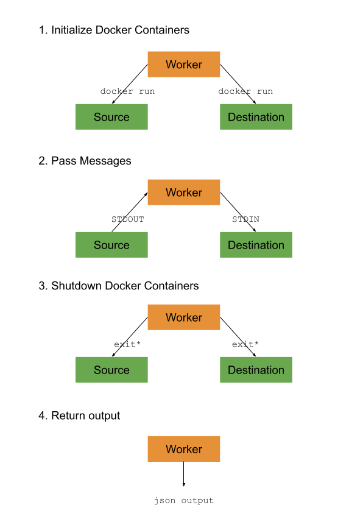

# Instruction 

## Concept 

### What are data integration tools 

Data integration tools are responsible for the Extract and Load (EL) steps of ELT. 

These tools have recently grew in popularity because of the surge of ELT as an architecture pattern.



The purpose of a data integration tool is to sync data between sources and destinations. 

Sources can include many different types, for example: files, APIs and databases. 


### Data integration tools

There are many choices for data integration tools these days. However, most of them have only emerged in recent years. 



### Airbyte 



Airbyte is one of the many data integration tools available. We will be using Airbyte during this course as airbyte: 
- Is open-source and free to use 
- Has a strong open source community 
- Supports a wide range of source and destination connectors 
- Has functionality to create your own custom connectors 

### Airbyte architecture 



- UI: An easy-to-use graphical interface for interacting with the Airbyte API.
- WebApp Server: Handles connection between UI and API.
- Config Store: Stores all the connections information (credentials, frequency...).
- Scheduler Store: Stores statuses and job information for the scheduler bookkeeping.
- Config API: Airbyte's main control plane. All operations in Airbyte such as creating sources, destinations, connections, managing configurations, etc.. are configured and invoked from the API.
- Scheduler: The scheduler takes work requests from the API and sends them to the Temporal service to parallelize. It is responsible for tracking success/failure and for triggering syncs based on the configured frequency.
- Temporal Service: Manages the task queue and workflows for the Scheduler.
Worker: The worker connects to a source connector, pulls the data and writes it to a destination.
- Temporary Storage: A storage that workers can use whenever they need to spill data on a disk.

### Airbyte worker 



A worker runs the source container and the destination container. 

The worker receives output from the source container and parses that through the dataset's schema (aka **catalog**), and then sends the data to the destination container so that it can be written to the target database. 

## Task 

### Deploy airbyte locally

1. Clone the airbyte repo locally from `https://github.com/airbytehq/airbyte.git` 

    ```
    git clone https://github.com/airbytehq/airbyte.git
    ```

2. Make sure you have Docker Desktop running first

3. Run the docker compose file 

    ```
    cd airbyte 
    docker-compose up
    ```

### Create a new source 

1. Go to sources and select "+ New source" 
2. For "Source type", select "Postgres": 
    - Name: `dvd_rental`
    - Host: `host.docker.internal` 
    - Port: `5432`
    - Database name: `dvd_rental` 
    - Schemas: `public` 
    - Username: `postgres`
    - Password: `postgres` 
3. Select "Set up source" 

### Create a new destination 

1. Go to destination and select "+ New destination" 
2. For "Destination type", select "Postgres": 
    - Name: `dw-001`
    - Host: `host.docker.internal` 
    - Port: `5432`
    - Database name: `dvd_rental` 
    - Schemas: `public` 
    - Username: `postgres`
    - Password: `postgres` 
3. Select "Set up destination" 

### Create a new connection (replication job)

1. Go to Connections and select "+ New connection" 
2. For Select an existing source, select "dvd_rental" and "Use existing source" 
3. For Select an existing destination, select "dw-001" and "Use existing destination" 
4. For the new connection: 
    - Connection name: `leave_as_default` 
    - Replication frequency: `Every 5 minutes` 
    - Destination namespace: `Mirror source structure` 
    - Activate streams you want to sync: `leave_as_default` 
5. Select "Set up connection" 

Note: We are currently performing `Source: Full refresh | Destination: Overwrite` for all tables. 

### Manually trigger the run 

1. Select "Sync now" 
2. Take note of the rows emitted, and rows committed 
3. Take notice of the `_staging` tables with JSON records before it becomes flattened in the final table 
4. Take notice of the data types from source vs target
