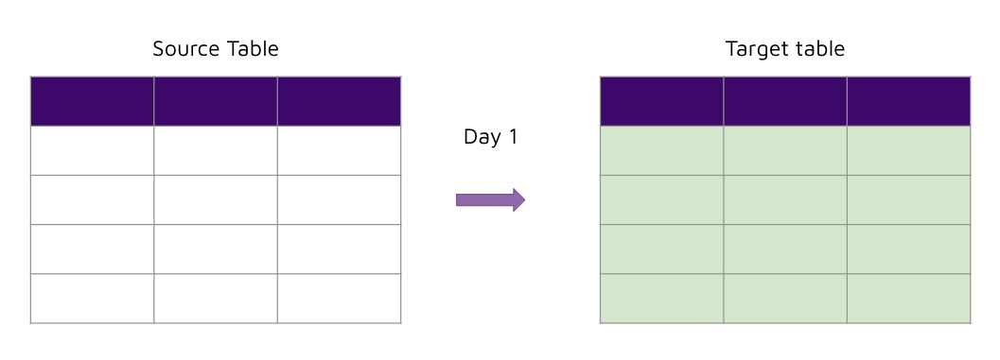
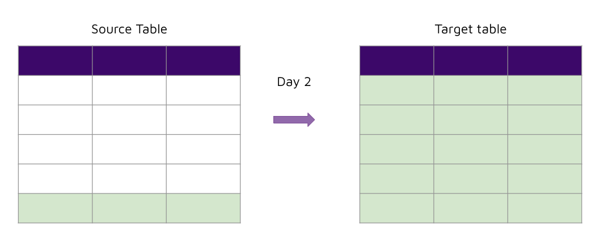
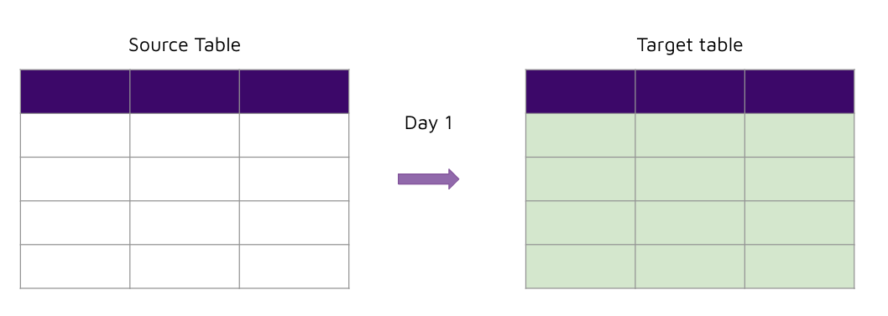
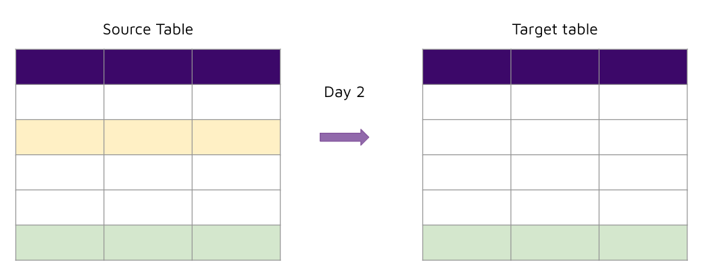
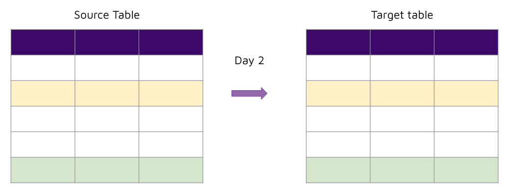
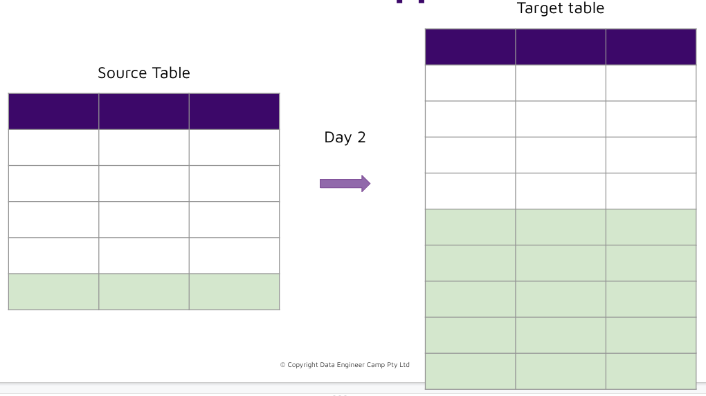

# Instruction 

## Concept 

Now that we have seen how to use Airbyte. Let's take a deeper dive into different airbyte sync modes. 

### Airbyte catalog 

The catalog tells airbyte how to process data returned from the source container. 

For example, assume we have the following tables in a database: 

```sql
CREATE TABLE "airlines" (
    "id"   INTEGER,
    "name" VARCHAR
);

CREATE TABLE "pilots" (
    "id"   INTEGER,
    "airline_id" INTEGER,
    "name" VARCHAR
);
```

Then the airbyte catalog (or schema) would need to look like: 

```json
{
  "streams": [
    {
      "name": "airlines",
      "supported_sync_modes": [
        "full_refresh",
        "incremental"
      ],
      "source_defined_cursor": false,
      "json_schema": {
        "type": "object",
        "properties": {
          "id": {
            "type": "number"
          },
          "name": {
            "type": "string"
          }
        }
      }
    },
    {
      "name": "pilots",
      "supported_sync_modes": [
        "full_refresh",
        "incremental"
      ],
      "source_defined_cursor": false,
      "json_schema": {
        "type": "object",
        "properties": {
          "id": {
            "type": "number"
          },
          "airline_id": {
            "type": "number"
          },
          "name": {
            "type": "string"
          }
        }
      }
    }
  ]
}
```

###  Sync modes 
- Source: Full Refresh | Destination: Overwrite 
- Source: Incremental | Destination: Append
- Source: Incremental | Destination: De-duped + history 
- Source: Full refresh | Destination: Append

#### Source: Full Refresh | Destination: Overwrite 





This is the easiest type of connection to use. 

Strengths: 
- Easy to set up. Does not require any primary key or cursor fields. 

Weaknesses: 
- Introduces load on source system as it always fetches all records. 


#### Source: Incremental | Destination: Append





Best used for processing event data that don't change. Requires a cursor field to work. 

Strengths: 
- Only processes new records in a performance manner. 

Weaknesses: 
- Does not handle updates to existing data. If your source system is append-only, then this is not a problem. 

#### Source: Incremental | Destination: De-duped + history 




Best used for processing high volumes of data that can have changes. Requires a primary key **and** cursor field to work. 

Strengths: 
- Only processes changed records in a performance manner. 

Weaknesses: 
- Requires a column that keeps track of the last update to a record and a primary key. 

#### Source: Full Refresh | Destination: Append 




Use only in very special situations. For example: 
- If you would like to keep a snapshot of the dataset each day. 

Strengths: 
- Easy to set up. Does not require any primary key or cursor fields. 

Weaknesses: 
- Creates a lot of duplicated data. 


## Task 

Perform an incremental sync between `dellstore` and `dw`.

### Create a new destination 

1. Go to destination and select "+ New destination" 
2. For "Destination type", select "Postgres": 
    - Name: `dw-002`
    - Host: `host.docker.internal` 
    - Port: `5432`
    - Database name: `dellstore` 
    - Schemas: `public` 
    - Username: `postgres`
    - Password: `postgres` 
3. Select "Set up destination" 


### Create a new connection 

1. Same as before
2. Change the sync mode for the following tables to either `Incremental | Deduped + history` or `Incremental | Append`: 
    - orders 

Q: Why do you think we've selected incremental extracts for these tables? 

### Manually trigger the run 

**First run**

1. Select "Sync now" 
2. Take note of the rows emitted, and rows committed 
3. Pay attention to the logs: 
    - `original cursor value null` 

**Second run**

1. Select "Sync now" 
2. Take note of the rows emitted, and rows committed 
3. Pay attention to the logs: 
    - `original cursor value` 
    - `new cursor value` 

**Third run**

1. Insert a new record to the orders table 

```sql
insert into actor 
(order_id, orderdate, customerid, netamount, tax, totalamount)
values
(12001, '2005-01-01', 16669, 200.10, 10.00, 210.10)
```

2. Select "Sync now" 
3. Take note of the rows emitted, and rows committed 
4. Pay attention to the logs: 
    - `original cursor value` 
    - `new cursor value` 
