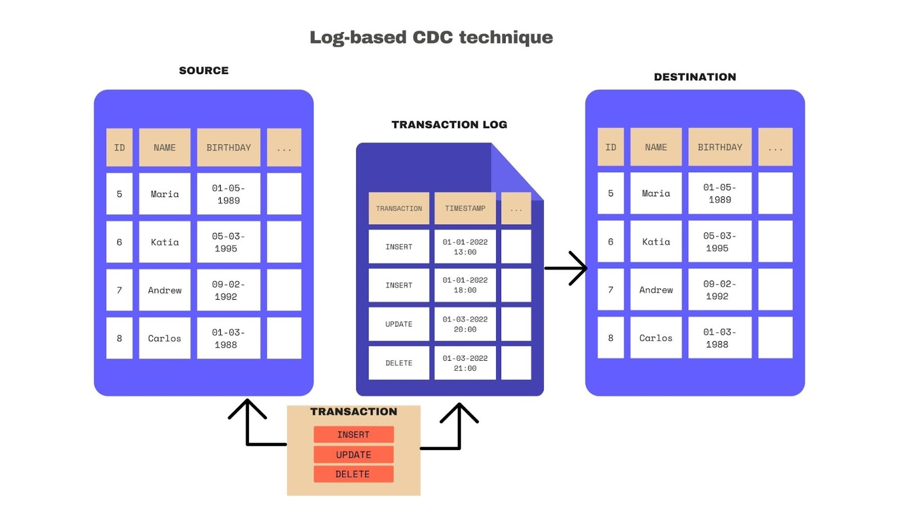

# Instruction 

## Concept 

Extracting data directly from source tables can have several downsides: 
- Introducing load directly to source tables 
- Requires a cursor field based on a timestamp to fetch data incrementally  

However, we can extract data using a table's transaction log. This approach is known as Change Data Capture (CDC). 



Benefits of this approach: 
- The query does not impact the source table. 
- Only new transactions are extracted without the need for a cursor field based on a timestamp. 

To support log-based CDC, Airbyte uses Debezium, an open-source platform that constantly monitors your databases, allowing your applications to stream database row-level changes. Airbyte is engineered to use Debezium as an embedded library, so you don’t need to worry about knowing its specifics.

## Task 

## 1. Setting up Postgres with CDC 

### PostgreSQL with CDC on AWS RDS (recommended)

```sql
--STEP 0
-- set up schema, table and 2 rows of data
CREATE SCHEMA datastore;

CREATE TABLE datastore.data_tbl
(
    id bigint,
    val character varying,
    PRIMARY KEY (id)
);

ALTER TABLE IF EXISTS datastore.data_tbl
    OWNER to postgres;


INSERT INTO datastore.data_tbl
VALUES (1, 'a'), (2, 'b');

select * from  datastore.data_tbl;

-- STEP 1
-- create read only user
CREATE USER airbyte PASSWORD '@irbyte';
GRANT USAGE ON SCHEMA datastore TO airbyte;

GRANT SELECT ON ALL TABLES IN SCHEMA datastore TO airbyte;
ALTER DEFAULT PRIVILEGES IN SCHEMA datastore GRANT SELECT ON TABLES TO airbyte;
-- role for cdc
GRANT rds_replication TO airbyte;

-- STEP 2
/*
https://docs.airbyte.com/integrations/sources/postgres#configuring-postgres-connector-with-change-data-capture-cdc
To enable logical replication on AWS Postgres RDS or Aurora:
1. Go to the Configuration tab for your DB cluster.
2. Find your cluster parameter group. Either edit the parameters for this group or create a copy of this parameter group to edit. If you create a copy, remember to change your cluster's parameter group before REBOOTING.
3. Within the parameter group page, search for rds.logical_replication. Select this row and click Edit parameters. Set this value to 1.
4. Apply the change immediately
*/

-- STEP 3
-- create replication slot
SELECT pg_create_logical_replication_slot('airbyte_slot', 'pgoutput');

-- STEP 4
-- create replication identities and publications for tables
ALTER TABLE datastore.data_tbl REPLICA IDENTITY DEFAULT;
CREATE PUBLICATION airbyte_publication FOR TABLE datastore.data_tbl;

-- STEP 5
/*
create source in airbyte
tick SSL
use Logical Replication CDC
*/
```

Making changes 

```sql
insert into datastore.data_tbl (id, val)
values (3, 'c'); 

delete from datastore.data_tbl where id = 2; 

update datastore.data_tbl 
set val = 'd' 
where id = 1; 
```


### Running PostgreSQL with Write Ahead Logs (Optional, unverified)

1. Run: 

```
docker run -d --name postgres -p 5433:5432 -e POSTGRES_USER=postgres \
-e POSTGRES_PASSWORD=postgres debezium/postgres:14
```

2. Run bash on the docker container 
```
docker exec -it postgres /bin/bash
```

3. Print out the contents of `postgresql.conf` 
```
cat /var/lib/postgresql/data/postgresql.conf
```

4. Restore dvd_rental database 


### Configuring PostgreSQL Write Ahead Logs (Optional, unverified)

Skip this step if you have used the Debezium/Docker image. 

Grant user permissions to access PostgreSQL's data folder. 

```
sudo chmod 777 /Library/PostgreSQL/14/data
```

Open up `postgresql.conf` file and modify the following: 

```
wal_level = logical
max_wal_senders = 1 
max_replication_slots = 1
```

Change the permissions back to the original: 

```
sudo chmod 700 /Library/PostgreSQL/14/data
```

Restart the postgresql server:

```
sudo -u postgres pg_ctl -D /Library/PostgreSQL/14/data restart
```

## 2. Configuring Airbyte 

Create a replication slot 

```
SELECT pg_create_logical_replication_slot('airbyte_slot', 'pgoutput');
```

(Optional) Drop a replication slot if one already exists 

```
select pg_drop_replication_slot('airbyte_slot')
```

Enable replication on table(s)

```
ALTER TABLE `name_of_table` REPLICA IDENTITY DEFAULT;
```

Create publication 

```
CREATE PUBLICATION airbyte_publication FOR TABLE <tbl1, tbl2, tbl3>;
```

**Create new airbyte source **

1. Go to sources and select "+ New source" 
2. For "Source type", select "Postgres": 
    - Name: `dvd_rental_cdc`
    - Host: `host.docker.internal` 
    - Port: `5432`
    - Database name: `dvd_rental` 
    - Schemas: `public` 
    - Username: `postgres`
    - Password: `postgres` 
    - Replication method: `Logical replication` 
    - Plugin: `pgoutput` 
    - Replication slot: `airbyte_slot`
    - Publication: `airbyte_publication` 
3. Select "Set up source" 

**Create new airbyte destination **

1. Go to sources and select "+ New source" 
2. For "Source type", select "Local JSON": 
    - Name: `Local JSON`
    - Destination path: `/tmp` 
3. Select "Set up destination"


**Create new connection **

1. Go to Connections and select "+ New connection" 
2. For Select an existing source, select "dvd_rental_cdc" and "Use existing source" 
3. For Select an existing destination, select "Local JSON" and "Use existing destination" 
4. For the new connection: 
    - Connection name: `leave_as_default` 
5. Select "Set up connection" 


### Check output 

Use `docker exec` to run commands inside the container. 

```
docker exec -it airbyte-server /bin/bash
```

When inside the container

```
cd /tmp/airbyte_local/tmp
ls 
cat <name_of_file>.jsonl
```
