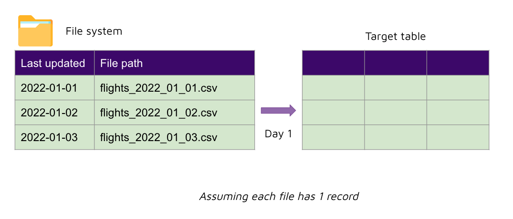
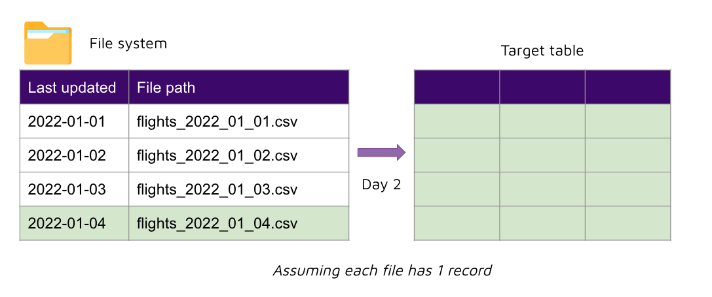
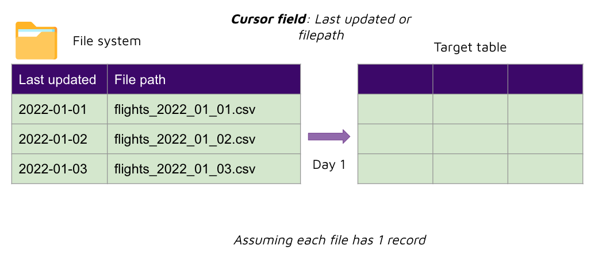
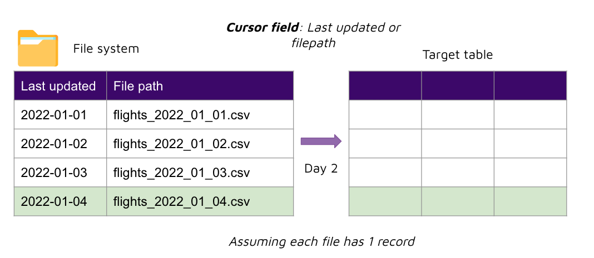

# Instruction 

## Concept 

Airbyte supports integration for files as well. 

The same sync modes that we covered off earlier for databases, are also supported with files. 

###  Sync modes 
- Source: Full Refresh | Destination: Overwrite 
- Source: Incremental | Destination: Append
- Source: Incremental | Destination: De-duped + history 
- Source: Full refresh | Destination: Append

#### Source: Full Refresh | Destination: Overwrite 

#### Source: Incremental | Destination: Append

Note: 
- The cursor field used is either the file's last modified timestamp, or the file path. The file path may include a timestamp e.g. `yyyy_mm_dd`, which would be useful in determining what are new files that need to be ingested. 

## Task 

### Upload files to S3 

1. Create a new S3 bucket e.g. `airbyte-demo-001`
2. Upload `airline.csv` to an S3 bucket. 

### Create IAM user for Airbyte 

1. Go to IAM 
2. Create a new user e.g. `airbyte` 
3. Select AWS credential type: `Access key` 
4. Set Permissions > attach existing policies directly > `AmazonS3FullAccess`
5. Next: Tags  
6. Next: Review
7. Create user 

### Create Airbyte Source for S3 

- Name: `airbyte-demo-001`
- Output stream name: `airline`
- Pattern of files to replicate: `*.csv`
- Bucket: `airbyte-demo-001`
- AWS access key ID: `<key id here>`
- AWS secret access key: `<key here>`
- Select "Set up source"  

### Create Airbyte Connection for S3 

For sync mode, select `Incremental | Deduped + history`: 
- Cursor field: `_ab_source_file_last_modified` 
- Primary key: `ID` 

