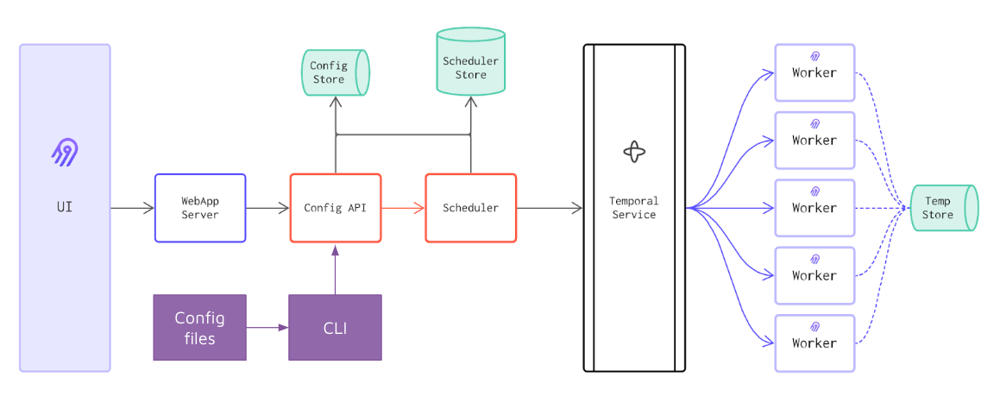

# Insruction 

## Concept 

The airbyte CLI is used to store the source/destination/connection configuration as code. 

This allows the configuration to be versioned in source control. 




## Task 

### Installing 

Refer to docs: https://github.com/airbytehq/airbyte/tree/master/octavia-cli

Install octavia cli using: 

MacOS: 
```
curl -s -o- https://raw.githubusercontent.com/airbytehq/airbyte/master/octavia-cli/install.sh | bash
```

This script:

1. Pulls the octavia-cli image from our Docker registry.
2. Creates an `octavia` alias in your profile.
3. Creates a `~/.octavia` file whose values are mapped to the octavia container's environment variables.


Windows: 
```
touch ~/.octavia # Create a file to store env variables that will be mapped the octavia-cli container
mkdir octavia_project_folder # Create your octavia project directory where YAML configurations will be stored.
docker run --name octavia-cli -i --rm -v full_path_to_octavia_project_folder:/home/octavia-project --network host --user $(id -u):$(id -g) --env-file ~/.octavia airbyte/octavia-cli:0.40.0-alpha
```


### Octavia commands 

Setting up a new project 
```
cd octavia_project
octavia init 
```

list all available sources
```
octavia list connectors sources
```

list all available destinations
```
octavia list connectors destinations
```

list workspace sources
```
octavia list workspace sources
```

list workspace destinations 
```
octavia list workspace destinations
```

list workspace connections 
```
octavia list workspace connections
```

get source details 
```
octavia get source <SOURCE_ID> or <SOURCE_NAME>
```

get destination details 
```
octavia get destination <DESTINATION_ID> or <DESTINATION_NAME>
```

get connection details 
```
octavia get connection <CONNECTION_ID> or <CONNECTION_NAME>
```

Import all existing resources (sources, destinations, connections) on your Airbyte instance to manage them with octavia-cli.
```
octavia import all
```

creating new sources 
```
octavia generate source <DEFINITION_ID> <SOURCE_NAME>
```

creating new destinations 
```
octavia generate destination <DEFINITION_ID> <DESTINATION_NAME>
```

creating new connections 
```
octavia generate connection --source <path-to-source-configuration.yaml> --destination <path-to-destination-configuration.yaml> <CONNECTION_NAME>
```

apply to airbyte instance 
```
octavia apply
# or 
octavia apply --force # run without prompts
```

