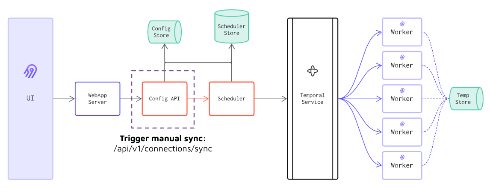

# Instruction 

## Concept 

We can call Airbyte's API to trigger an airbyte connection sync. 

This is useful when integration airbyte into our ELT pipelines. 

Airbyte will perform the Extract and Load, and then we can kick off the transformation job as soon as the Extract and Load job is complete. 

## Task 

1. Create a new connection in Airbyte to sync between S3 files to Postgres
2. Go to https://airbyte-public-api-docs.s3.us-east-2.amazonaws.com/rapidoc-api-docs.html to see airbyte api docs 
3. Trigger the connection sync 
4. Check the status of the connection sync 
