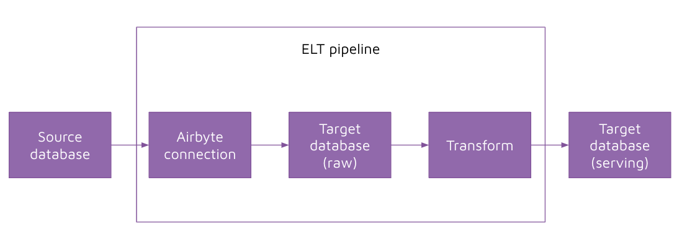

# Instruction 

## Concept 

We have previously created our own Extract and Load integration using custom Python code. Let's replace that with an airbyte connection. 

## Task 

### Create airbyte connection 

1. Create the source to `dellstore2`
2. Create the destination to `dw`
3. Create the connection to sync data between `dellstore2` and `dw` 
4. Test the connection - run the connection and validate that data is copied across 

### Integrate airbyte with the ELT pipeline 

1. Refactor the code to remove our custom extract and load pipeline 
2. Replace it with an API call to sync data
3. Run the ELT pipeline and verify that data is copied across 

