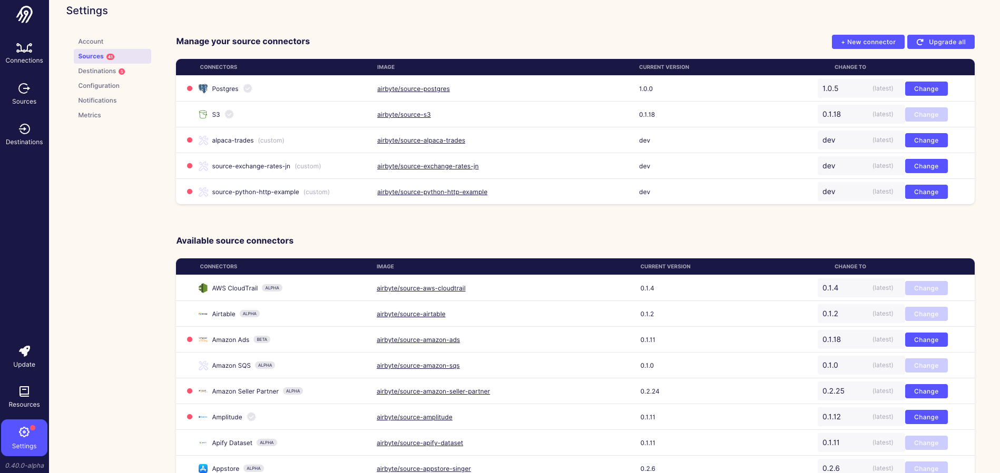

# Instruction 

## Concept 

Airbyte provides over a hundred connectors out of the box. 

However, there can be sources that Airbyte does not have connectors for. In those scenarios, Airbyte provides a Connector Development Kit (CDK) for developers to build and publish their own connectors. 

Connector development kit (CDK) languages supported: 
- Python
- Java 
- C#/.NET 
- TS/JS 

Let's build our own connector for an API using the Python CDK. 


## Implement  

### API 

We are going to build a connector to the Exchange Rates Data API: https://apilayer.com/marketplace/exchangerates_data-api

### Creating the source 

1. Clone the airbyte repo https://github.com/airbytehq/airbyte
2. `cd airbyte-integrations/connector-templates/generator` 
3. `./generate.sh` and select 
    - Python HTTP API Source
    - Provide the name `python-http-example` 
4. Review the new source connector template that has been created 

### Install dependencies  

```
cd ../../connectors/source-python-http-example
python -m venv .venv # Create a virtual environment in the .venv directory
conda deactivate # dectivate your conda environment 
source .venv/bin/activate # enable the venv
pip install -r requirements.txt
```

### Define the input parameter  

Airbyte provides a file called `spec.yaml`. This file defines the input parameters that the connector must receive when used. 

Configure `spec.yaml` to the following for exchange rates api: 

```
documentationUrl: https://apilayer.com/marketplace/exchangerates_data-api
connectionSpecification:
  $schema: http://json-schema.org/draft-07/schema#
  title: Python Http Tutorial Spec
  type: object
  required:
    - apikey
    - start_date
    - base
  properties:
    apikey:
      type: string
      description: API key used to retrieve data from the Exchange Rates API.
    start_date:
      type: string
      description: Start getting data from that date.
      pattern: ^[0-9]{4}-[0-9]{2}-[0-9]{2}$
      examples:
        - "%Y-%m-%d"
    base:
      type: string
      examples:
        - USD
        - EUR
      description: "ISO reference currency. See <a href=\"https://www.ecb.europa.eu/stats/policy_and_exchange_rates/euro_reference_exchange_rates/html/index.en.html\">here</a>."
```

### Implement `check` operation 

Airbyte uses `SourcePythonHttpExample` as the entrypoint class used for the connector. 

The class needs to implement two methods: 
- `check_connection()`: used by airbyte to check if the connection works 
- `streams()`: used by airbyte to start the stream (aka data extraction or loading)

In `/source_python_http_example/source.py`: 
```python 
class SourcePythonHttpExample(AbstractSource):
    
    def check_connection(self, logger, config) -> Tuple[bool, any]:
        accepted_currencies = {"USD", "JPY", "BGN", "CZK", "DKK"}  # assume these are the only allowed currencies
        input_currency = config['base']
        if input_currency not in accepted_currencies:
            return False, f"Input currency {input_currency} is invalid. Please input one of the following currencies: {accepted_currencies}"
        else:
            return True, None
```

In `/secrets`: 

```
echo '{"start_date": "2022-04-01", "base": "USD", "apikey": <your_apikey>}'  > secrets/config.json
echo '{"start_date": "2022-04-01", "base": "BTC", "apikey": <your_apikey>}'  > secrets/invalid_config.json
python main.py check --config secrets/config.json
python main.py check --config secrets/invalid_config.json
```

### Define the schema 

Create class for exchange rates.

```python
class ExchangeRates(HttpStream): 
  url_base = "https://api.apilayer.com/exchangerates_data/"
  primary_key = "date" 

  def __init__(self, config: Mapping[str, Any], start_date: datetime, **kwargs):
    super().__init__()
    self.base = config['base']
    self.apikey = config['apikey']
    self.start_date = start_date
```

Set next page token to none: 

```python
class ExchangeRates(HttpStream): 
  ... 
  def next_page_token(self, response: requests.Response) -> Optional[Mapping[str, Any]]:
    # this api does not offer pagination, so we return None to indicate that there are no more pages 
    return None         
```

The API endpoint is constructed by combining the `base_url` variable with the value returned from `path()`. 

```python
class ExchangeRates(HttpStream): 
  ...
  def path(
      self, 
      stream_state: Mapping[str, Any] = None, 
      stream_slice: Mapping[str, Any] = None, 
      next_page_token: Mapping[str, Any] = None
    ) -> str:
    # The "/latest" path gives us the latest currency exchange rates
    return "latest"
```

Create the request headers used for this request. 

```python
class ExchangeRates(HttpStream): 
  ... 
  def request_headers(
    self,
    stream_state: Mapping[str, Any],
    stream_slice: Mapping[str, Any] = None,
    next_page_token: Mapping[str, Any] = None,
  ) -> MutableMapping[str, Any]:
    # The api requires that we include apikey as a header
    return {'apikey': self.apikey}
```

Note: we can also use `request_params` if we need to specify query parameters. 

Implement the `parse_response` method to return JSON to the worker. 

```python
class ExchangeRates(HttpStream): 
  def parse_response(
    self,
    response: requests.Response,
    stream_state: Mapping[str, Any],
    stream_slice: Mapping[str, Any] = None,
    next_page_token: Mapping[str, Any] = None,
  ) -> Iterable[Mapping]:
    # The response is a simple JSON whose schema matches our stream's schema exactly, 
    # so we just return a list containing the response
    return [response.json()]
```

Implement the `stream()` method for the source connector class. The stream is the entrypoint method used to to perform the extraction or loading of data. 

```python
class SourcePythonHttpExample(AbstractSource):
  ...
  def streams(self, config: Mapping[str, Any]) -> List[Stream]:
    # NoAuth just means there is no authentication required for this API and is included for completeness.
    # Skip passing an authenticator if no authentication is required.
    # Other authenticators are available for API token-based auth and Oauth2. 
    auth = NoAuth()  
    return [ExchangeRates(authenticator=auth, config=config, start_date=start_date)]
```

Finally, we need to specify the JSON output data that is returned from the connector. Place [exchange_rates.json](exchange_rates.json) into the `/source_python_http_example/schemas` folder. 

### Test the connector 

#### Create a mock connection 
Create a mock connection configuration using the [configured_catalog.json](configured_catalog.json) file. This file mocks a connection being created in the airbyte user interface. Place that `configured_catalog.json` file into a temporary folder `sample_files` (does not matter the name you decide to give it).

#### Create a secrets file 

Create a `/secrets/config.json` file that contains. 

```json
{"start_date": "2022-08-16", "base": "USD", "apikey": "your_api_key"}
```

This file is only used for testing purposes. 

#### Test the connector 

Test that the connector works locally by running: 
```
python main.py read --config secrets/config.json --catalog sample_files/configured_catalog.json
```

You should see an output similar to: 
```
"type": "RECORD", "record": {"stream": "exchange_rates", "data": {"success": true, "timestamp": 1651129443, "base": "EUR", "date": "2022-04-28", "rates": {"AED": 3.86736, "AFN": 92.13195, "ALL": 120.627843, "AMD": 489.819318, "ANG": 1.910347, "AOA": 430.073735, "ARS": 121.119674, "AUD": 1.478877, "AWG": 1.895762, "AZN": 1.794932, "BAM": 1.953851, "BBD": 2.140212, "BDT": 91.662775, "BGN": 1.957013, "BHD": 0.396929, "BIF": 2176.669098, "BMD": 1.052909, "BND": 1.461004, "BOB": 7.298009, "BRL": 5.227798, "BSD": 1.060027, "BTC": 2.6717761e-05, "BTN": 81.165435, "BWP": 12.802036, "BYN": 3.565356, "BYR": 20637.011334, "BZD": 2.136616, "CAD": 1.349329, "CDF": 2118.452361, "CHF": 1.021627, "CLF": 0.032318, "CLP": 891.760584, "CNY": 6.953724, "COP": 4171.971894, "CRC": 701.446322, "CUC": 1.052909, "CUP": 27.902082, "CVE": 110.15345, "CZK": 24.499027, "DJF": 188.707108, "DKK": 7.441548, "DOP": 58.321493, "DZD": 152.371647, "EGP": 19.458297, "ERN": 15.793633, "ETB": 54.43729, "EUR": 1, "FJD": 2.274651, "FKP": 0.80931, "GBP": 0.839568, "GEL": 3.20611, "GGP": 0.80931, "GHS": 7.976422, "GIP": 0.80931, "GMD": 56.64554, "GNF": 9416.400803, "GTQ": 8.118402, "GYD": 221.765423, "HKD": 8.261854, "HNL": 26.0169, "HRK": 7.563467, "HTG": 115.545574, "HUF": 377.172734, "IDR": 15238.748216, "ILS": 3.489582, "IMP": 0.80931, "INR": 80.654494, "IQD": 1547.023976, "IRR": 44538.040218, "ISK": 137.457233, "JEP": 0.80931, "JMD": 163.910125, "JOD": 0.746498, "JPY": 137.331903, "KES": 121.87429, "KGS": 88.581418, "KHR": 4286.72178, "KMF": 486.443591, "KPW": 947.617993, "KRW": 1339.837191, "KWD": 0.322886, "KYD": 0.883397, "KZT": 473.770223, "LAK": 12761.755235, "LBP": 1602.661797, "LKR": 376.293562, "LRD": 159.989586, "LSL": 15.604181, "LTL": 3.108965, "LVL": 0.636894, "LYD": 5.031557, "MAD": 10.541225, "MDL": 19.593772, "MGA": 4284.002369, "MKD": 61.553251, "MMK": 1962.574442, "MNT": 3153.317641, "MOP": 8.567461, "MRO": 375.88824, "MUR": 45.165684, "MVR": 16.199478, "MWK": 865.62318, "MXN": 21.530268, "MYR": 4.594366, "MZN": 67.206888, "NAD": 15.604214, "NGN": 437.399752, "NIO": 37.965356, "NOK": 9.824365, "NPR": 129.86672, "NZD": 1.616441, "OMR": 0.405421, "PAB": 1.060027, "PEN": 4.054233, "PGK": 3.73593, "PHP": 55.075028, "PKR": 196.760944, "PLN": 4.698101, "PYG": 7246.992296, "QAR": 3.833603, "RON": 4.948144, "RSD": 117.620172, "RUB": 77.806269, "RWF": 1086.709833, "SAR": 3.949063, "SBD": 8.474149, "SCR": 14.304711, "SDG": 470.649944, "SEK": 10.367719, "SGD": 1.459695, "SHP": 1.45028, "SLL": 13082.391386, "SOS": 609.634325, "SRD": 21.904702, "STD": 21793.085136, "SVC": 9.275519, "SYP": 2645.380032, "SZL": 16.827859, "THB": 36.297991, "TJS": 13.196811, "TMT": 3.685181, "TND": 3.22348, "TOP": 2.428117, "TRY": 15.575532, "TTD": 7.202107, "TWD": 31.082183, "TZS": 2446.960099, "UAH": 32.065033, "UGX": 3773.578577, "USD": 1.052909, "UYU": 43.156886, "UZS": 11895.19696, "VEF": 225143710305.04727, "VND": 24171.62598, "VUV": 118.538204, "WST": 2.722234, "XAF": 655.287181, "XAG": 0.045404, "XAU": 0.000559, "XCD": 2.845538, "XDR": 0.783307, "XOF": 655.293398, "XPF": 118.347299, "YER": 263.490114, "ZAR": 16.77336, "ZMK": 9477.445964, "ZMW": 18.046154, "ZWL": 339.036185}}, "emitted_at": 1651130169364}}
```


### Use the connector in airbyte 


#### Building and configuring the connector 

1. Build the connector 

```
docker build . -t airbyte/source-python-http-example:dev
```

2. Go to airbyte (localhost:8000)

3. Select `Settings`

4. Select `Sources`



5. Select `+ New connector` 
  - Display name: `source-python-http-example`
  - Docker repository name: `airbyte/source-python-http-example`
  - Docker image tag: `dev` 
  - Connector documentation url: `https://apilayer.com/marketplace/exchangerates_data-api` 

6. Select `Add` 


#### Using the connector 

Go ahead and create a new source and connection using the connector and verify that data is able to be synced to the destination. 

