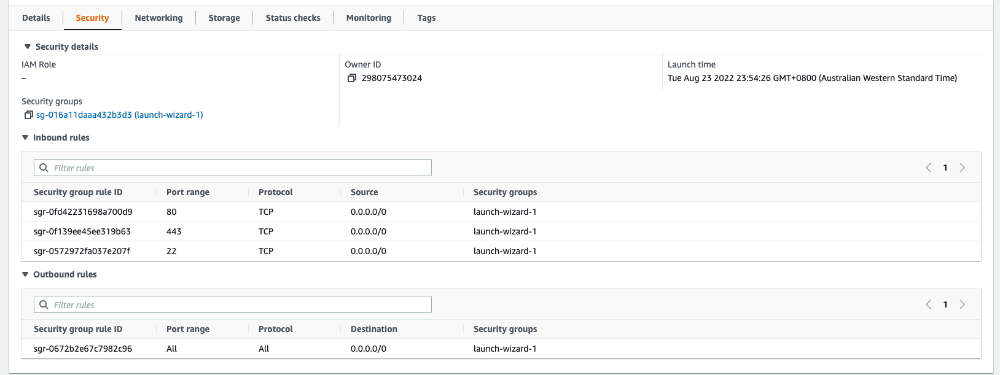
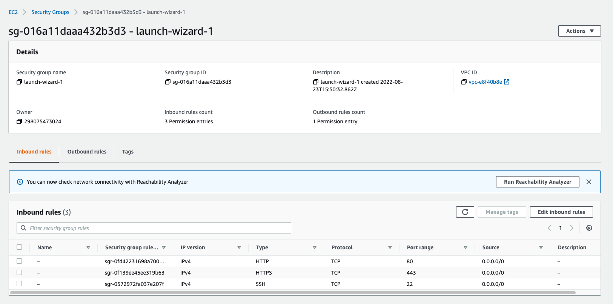
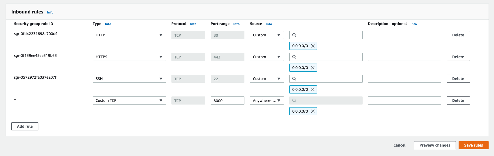
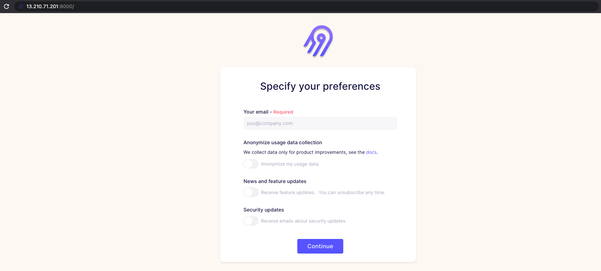

# Instruction 

## Task 

Follow airbyte deployment steps here: https://docs.airbyte.com/deploying-airbyte/on-aws-ec2 

Stop before "Connect to airbyte". 









Access via the public DNS address or public IPv4 address.

Note: that every time you stop and restart the instance: 
1. the IP address changes. 
2. the docker stops and needs to be restarted. 

To have a fixed IP address, you will have to go to: 
1. Elastic IPs (left panel in EC2)
2. Allocate Elasitc IP address
    - Amazon's pool of IPv4 addresses 
    - Allocate 
3. Select the new IP address > Associate Elastic IP address
    - Instance 
    - Instance: `<select_your_instance>` 
    - Associate 

To restart docker on an EC2 instance, you will have to ssh into the EC2 instance and run: 
```
sudo systemctl start docker
```
