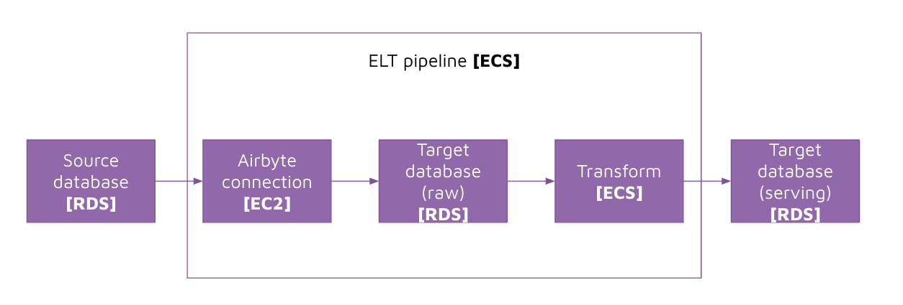

# Instruction 

## Concept 



Now let's host the entire ELT solution on AWS. 
- `Source database`: We are going to host our source database using AWS RDS
- `Airbyte`: We are going to host airbyte on an EC2 instance
- `Target database`: We are going to host our target database using AWS RDS
- `Transform`: We are going to host our transformation code as part of the ELT pipeline container on ECS
- `ELT pipeline`: We are going to host our ELT pipeline on ECS and use a scheduled task 

## Task 


### Create ECR 

1. Search for "ECR" in the AWS Console 
2. Select "Create repository":
    - Visibility settings: `Private`
    - Repository name: `"provide_name_here"`
3. Select "Create repository"

### Building and pushing image 

#### Connect to ecr 
```
aws ecr get-login-password --region ap-southeast-2 | docker login --username AWS --password-stdin <ecr_instance_url>
```

#### Build image 
```
docker build -t <image_name> .
```

#### Tag image 
```
docker tag <image_name>:latest <ecr_instance_url>/<image_name>:latest
```

#### Push image 
```
docker push <ecr_instance_url>/<image_name>:latest
```

### Create .env file 

Create an `.env` file to store environment variables

```
source_db_user=<TODO>
source_db_password=<TODO>
source_db_server_name=<TODO>
source_db_database_name=<TODO>
target_db_user=<TODO>
target_db_password=<TODO>
target_db_server_name=<TODO>
target_db_database_name=<TODO>
airbyte_host=<TODO>
airbyte_connection_id=<TODO>
```

### Uploading the .env file to S3 

1. Create a new bucket that is `private` (**important**: the bucket has to be private so that no one can steal your credentials)
2. Upload the `.env` file to the S3 bucket 

### Update IAM Role with permissions to S3 bucket 

### Create new role for ECS to access S3 files 

1. Go to IAM 
2. Select "Roles" 
3. Select "Create role" 
4. Select "AWS service": 
    - Use case: "Elastic Container Service" > "[x] Elastic Container Service Task"
5. Under "Permissions policies", select "AmazonECSTaskExecutionRolePolicy". Select "Next". 
6. For role name, provide a name that relates to the ECS Task Definition e.g. DellstoreETL
7. Select "Create role" 
8. Go to the newly created role 
9. Select "Add permissions" > "Create inline policy" > "JSON"

    Add the below in-line policy: (note you will have to update examplebucket, folder_name and env_file_name accordingly)

    ```json 
    {
        "Version": "2012-10-17",
        "Statement": [
            {
            "Effect": "Allow",
            "Action": [
                "s3:GetObject",
                "s3:GetBucketLocation"
            ],
            "Resource": [
                "arn:aws:s3:::examplebucket/folder_name/env_file_name"
            ]
            },
            {
            "Effect": "Allow",
            "Action": [
                "s3:GetBucketLocation"
            ],
            "Resource": [
                "arn:aws:s3:::examplebucket"
            ]
            }
        ]
    }
    ```
10. Select "Review policy" 
11. Provide a name for the policy e.g. ReadS3EnvFile
12. Select "Create policy" 

### Create a ECS cluster 

1. Search for "ECS" in AWS Console 
2. Select "Create cluster" 
3. Select "EC2 Linux + Networking", and select "Next step" 
4. Configure cluster; 
    - Cluster name: `<provide_a_name>` 
    - Provision Model: `[x] On-Demand Instance` 
    - EC2 instance type: `t2.micro` (**important**: select `t2.micro` to make use of AWS Free Tier and avoid any costs)
    - Number of instances: `1` 
    - Networking: 
        - VPC: select your existing VPC (every AWS account has a VPC created by default)
        - Subnets: select any existing Subnet (every AWS account has a VPC and subnets created by default). 
        - Security group: select the existing default security group 
    - Container instance IAM role: `Create new role` 
5. Select "Create" 

### Review cluster 

- `Tasks`: One-off tasks that are runninng on EC2 instances. 
- `Scheduled tasks`: Tasks that run on a schedule on EC2 instances. 
- `ECS Instances`: EC2 instances that has been created. 
- `Services`: A long-running service (e.g. API, Web Application) that runs on EC2 instances. 

### Create task definitions 

1. On the left panel, select "Task definitions" 
2. Select "Create new Task Definition" 
3. Select "EC2" > "Next step": 
    - Task definition name: `<provide_a_name>`
    - Task role: `select the role you have created before`
    - Task execution IAM role: `select the role you have created before`
    - Network mode: `default` 
    - Task memory (MiB): `128`
    - Task CPU (unit): `1 vCPU` 
    - Container definitions > Select "Add container":   
        - Container name: `<provide_a_name>`
        - Image: `<copy_image_uri_from_ecr>` 
        - Private repository authentication: [ ]  (leave unchecked)
        - Memory limits (MiB): [ ] (leave empty)
        - Select Environment files "+" 
            - Source: `S3 ARN` 
            - Location: `<copy_object_arn_from_s3>` e.g. `arn:aws:s3:::my_bucket/.env` 
    - Click "Add" 
    - Click "Create" 

### Run a task (one-off)

1. Go to your cluster > select "Tasks"
2. Select "Run new Task": 
    - Launch type: `"EC2"` 
    - Task Definition: `<select_your_task_definition>` 
    - Number of tasks: `1`
3. Select "Run Task"
4. Verify that tables have been created in the target database 


### Create scheduled tasks 

1. In ECS, select your cluster
2. Select "Scheduled Tasks" > "Create": 
    - Schedule rule name: `<provide_a_name>` 
    - Run at fixed interval: `2 minutes` 
    - Target id: `<provide_a_name>` 
    - Task Definition: `<select_your_task_definition>` 
    - Select "Create" 
