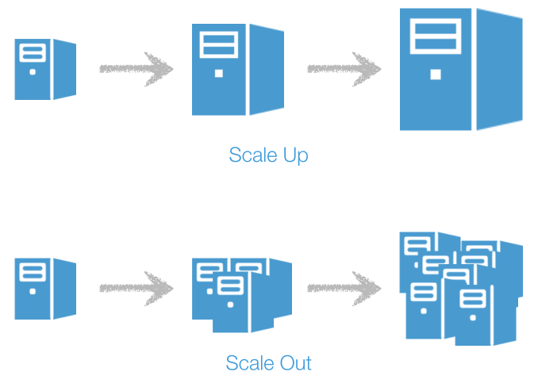
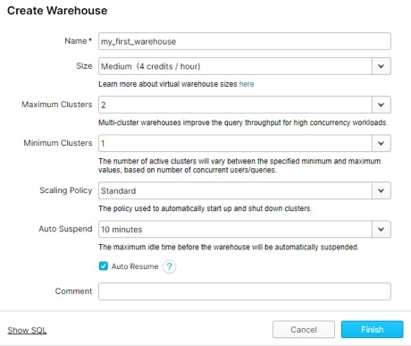
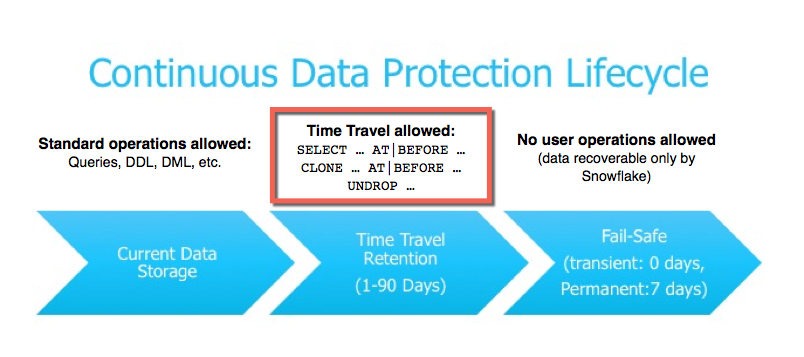
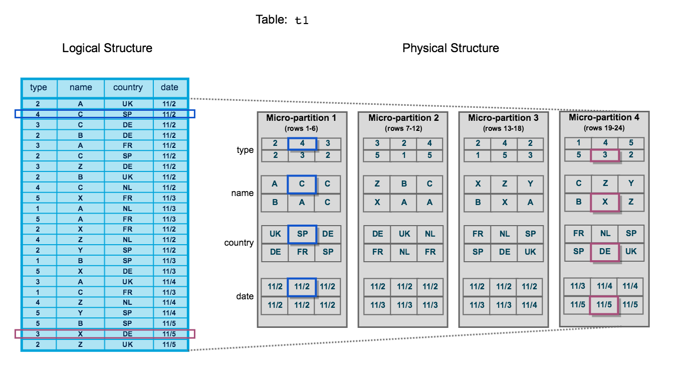
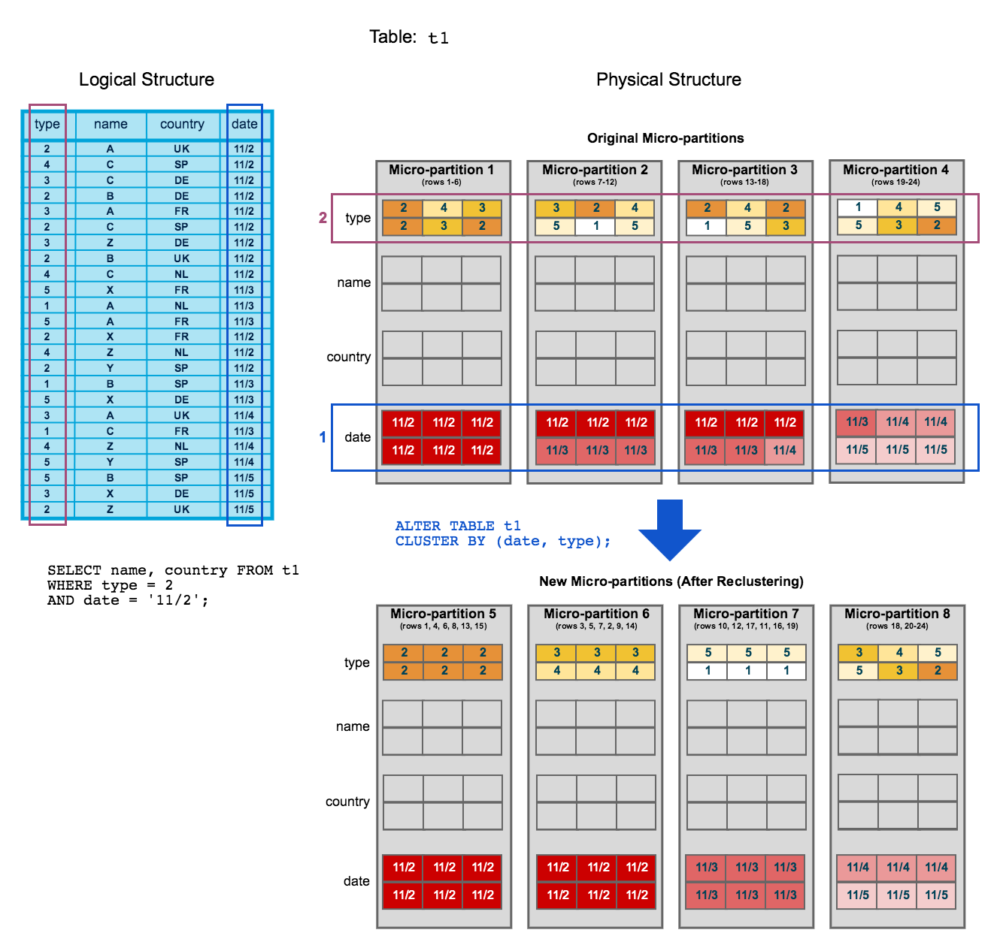
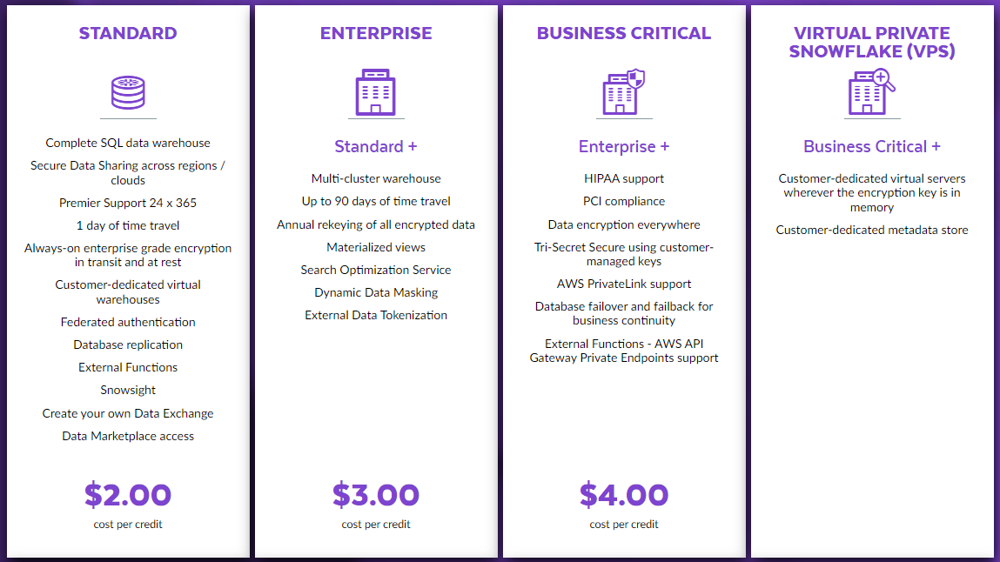

# Instruction

Congratulations! You just landed a new job and become the Lead Data Engineer at **DEC.com**

Your manager is a big fan of **Snowflake** and **dbt**. He has decided to use these two tools as the core of your company's data stack.

He also knows that you have no prior experience with Snowflake or dbt. So he kindly gave you the below material to help you get your head around. You are also given the privilege to learn more details on the job.

## Concept 
### What is and is not Snowflake?
- **Cloud native**: it runs on AWS, GCP and Azure
- **SaaS**: there is no need to install any software or manage any infra
- **Warehouse**: heavily SQL based, proprietary SQL engine

### What makes up Snowflake?


#### Managed storage in cloud
- Snowflake manages every aspect of your data storage (the organisation, file size, structure, compression, metadata, statistics)
- Snowflake store your data in its internal optimized, compressed, columnar format in cloud

#### Separated compute and storage
- Data storage is completely irrelevant to compute. You could have 1000 PB data with a 1 vCPU query node, or 1 KB data with a 1000 vVPU query node.
- The underlying Snowflake files are stored in a cloud storage (e.g. S3 for Snowflake hosted on AWS)
- Configured and billed separately
- Can be paused and resumed

#### Compute, at scale
- T-shirt size nodes (XS all the way to 6XL)
- In an enterprise setting, your warehouse often needs to serve a large audience
- Snowflake supports **multi-cluster** warehouses
- Configure your own cluster (minimum/maximum number of nodes and standard vs. economy scaling policy)
- Not to confuse scale-up vs scale-out



### Table Types
#### Time Travel
- Query, clone, restore data up to 90 days back.
```
SELECT ... 
FROM ... 
AT( TIMESTAMP=<timestamp> | OFFSET=<time_diff> | STATEMENT=<id> ) | BEFORE( STATEMENT=<id> )
```


#### Fail-safe
- Disaster recovery
- Not really queryable
- Extra storage cost

#### Temporary Tables
- In-session table

#### Transient Tables
- Somewhere between Temporary and Permanent
- Persists until explicitly dropped
- 1 day time travel, 0 day fail-safe

#### Permanent Tables
- The default type if you don't specify
- Persists until explicitly dropped
- 90 day time travel, 7 day fail-safe

#### Comparison
| Type      | Persistence              | Time Travel Retention Period | Fail-safe Period |
|-----------|--------------------------|------------------------------|------------------|
| Temporary | Remainder of session     | 0 or 1 day                   | 0 day            |
| Transient | Until explicitly dropped | 0 or 1 day                   | 0 day            |
| Permanent | Until explicitly dropped | 0 or 1 day                   | 7 days           |

Rule of thumb
- if a table can be reproduced, use Transient to save storage cost
- if a table is of ultra importance, use Permanent to utilise the protections

### Table Structure
#### Micro partitions
- A micro-partition = several rows
- Columnar inside a micro-partition
- Automatic micro-partitions (50-500 MB before compression data)
- Metadata about all rows in a micro-partition are stored (e.g. the range of values, the number of distinct values etc.)



#### Clustering keys
Pruning is what makes a query fast!!!



### Editions and Pricing
- **Credits**
- [Editions](https://www.snowflake.com/pricing/)
  - Higher the edition, higher price per credit
- Compute
  - More powerful virtual warehouse = more credit consumption
  - Larger virtual warehouse cluster = more credit consumption
  - Longer running query = more credit consumption
- Storage
  - On Demand Storage vs. Capacity Storage
- Cloud services incur charges (see in UI)




### SQL Reference
Almighty and All-inclusive Snowflake [SQL reference](https://docs.snowflake.com/en/sql-reference/sql-all.html)
